<div align="center">


# IPlay - Learn IP Rights the Fun Way! 🎮

### India's First Gamified Mobile Learning Platform for Intellectual Property Rights

[](https://flutter.dev/)
[](https://firebase.google.com/)
[](LICENSE)

**📚 60 Levels** • **🎮 7 Games** • **🏆 50+ Badges** • **🆓 Free Forever**

[🚀 Quick Start](#-quick-start) • [🎮 Games](#-games) • [📚 Features](#-features) • [🤝 Contributing](#-contributing)

</div>

---

## 🌟 What is IPlay?

IPlay transforms complex Intellectual Property Rights education into an exciting mobile game. Students learn through **6 interactive realms**, **7 action-packed games**, and a comprehensive reward system - all completely free!

### Why IPlay?

- 🎮 **Gamified Learning**: XP, badges, streaks, and leaderboards keep you motivated
- 📚 **Complete Curriculum**: 60 levels covering all IPR topics in India
- 🎯 **7 Interactive Games**: From quiz challenges to tower defense
- 🏫 **School Integration**: Classroom management, assignments, and analytics
- 📱 **Offline Ready**: All content works without internet
- 🆓 **Free Forever**: No ads, no subscriptions, no hidden costs

---

## 📊 Quick Stats

<div align="center">

| 📚 Content | 🎮 Games | 🏆 Rewards | 👥 Features |
|:---:|:---:|:---:|:---:|
| **60** Levels | **7** Games | **50+** Badges | Classroom Management |
| **60** Quizzes | Daily Challenges | XP System | Assignment System |
| **6** IPR Realms | High Scores | Certificates | Leaderboards |
| **600+** Questions | Real Scenarios | Streak Tracking | Progress Analytics |

</div>

---

## 🎯 The Six IPR Realms

<table>
<tr>
<td align="center" width="33%">
<br/>
<strong>📚 Copyright</strong><br/>
Protect creative works like books, music, art, and software
</td>
<td align="center" width="33%">
<br/>
<strong>🏷️ Trademark</strong><br/>
Guard brand identity, logos, and company names
</td>
<td align="center" width="33%">
<br/>
<strong>🔬 Patent</strong><br/>
Secure innovations and inventions
</td>
</tr>
<tr>
<td align="center" width="33%">
<br/>
<strong>🎨 Design</strong><br/>
Safeguard product aesthetics and appearance
</td>
<td align="center" width="33%">
<br/>
<strong>🗺️ GI</strong><br/>
Celebrate regional heritage products
</td>
<td align="center" width="33%">
<br/>
<strong>🔐 Trade Secrets</strong><br/>
Master confidential business information
</td>
</tr>
</table>

**Each realm includes 10 levels** with progressive difficulty (Easy → Medium → Hard → Expert), interactive quizzes, and real-world case studies.

---

## 🎮 Games

Learn through play! Seven engaging games that make IPR concepts stick:

<table>
<tr>
<td align="center" width="25%">
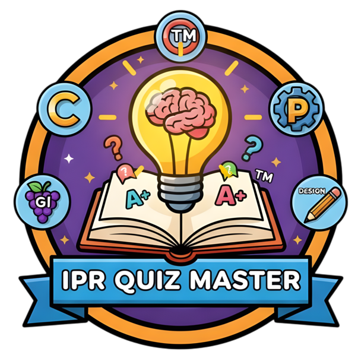<br/>
<strong>Quiz Master</strong><br/>
Rapid-fire 60-second challenges
</td>
<td align="center" width="25%">
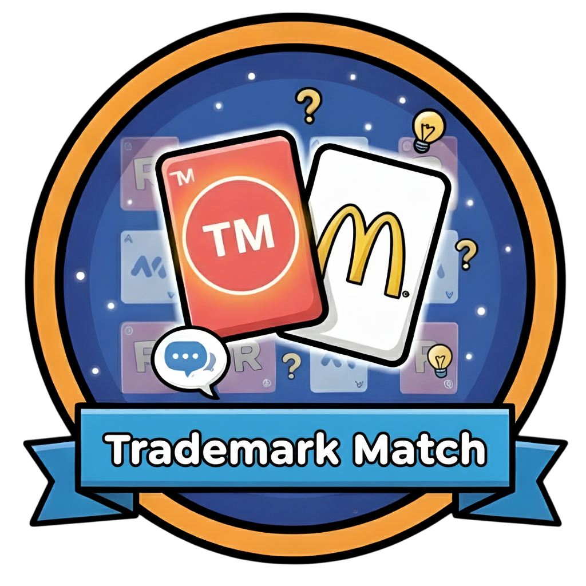<br/>
<strong>Trademark Match</strong><br/>
Memory game with 30+ brands
</td>
<td align="center" width="25%">
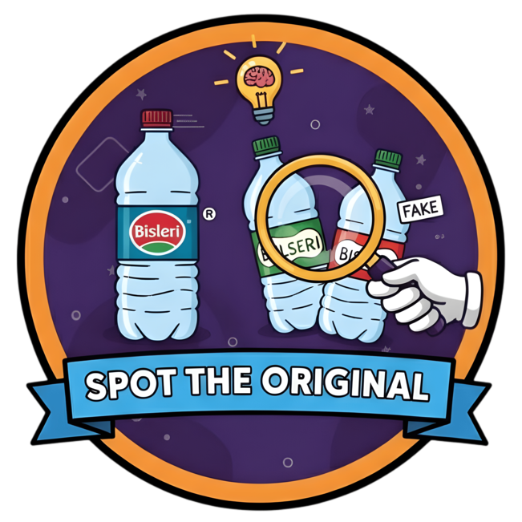<br/>
<strong>Spot Original</strong><br/>
Identify genuine vs fake products
</td>
<td align="center" width="25%">
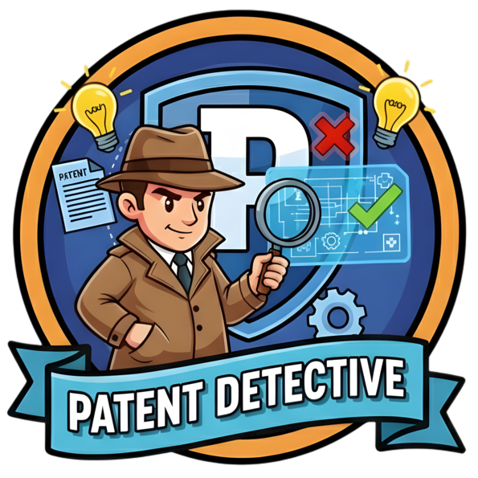<br/>
<strong>Patent Detective</strong><br/>
Investigate prior art searches
</td>
</tr>
<tr>
<td align="center" width="25%">
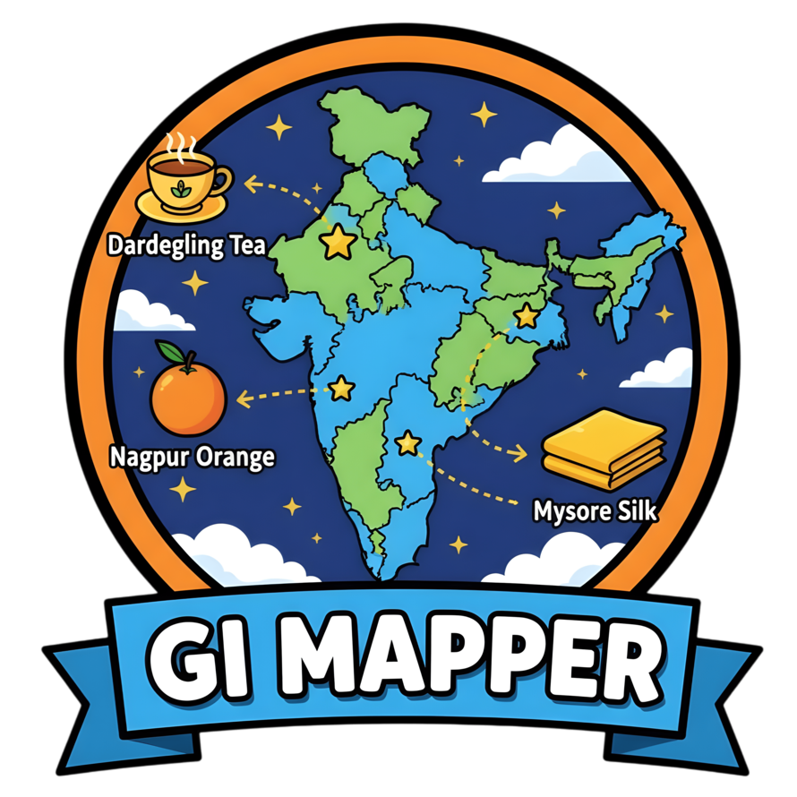<br/>
<strong>GI Mapper</strong><br/>
Match products to Indian states
</td>
<td align="center" width="25%">
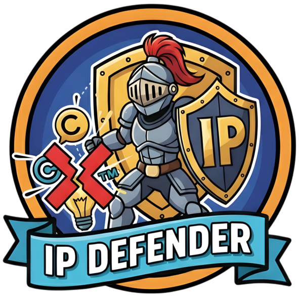<br/>
<strong>IP Defender</strong><br/>
Tower defense strategy game
</td>
<td align="center" width="25%">
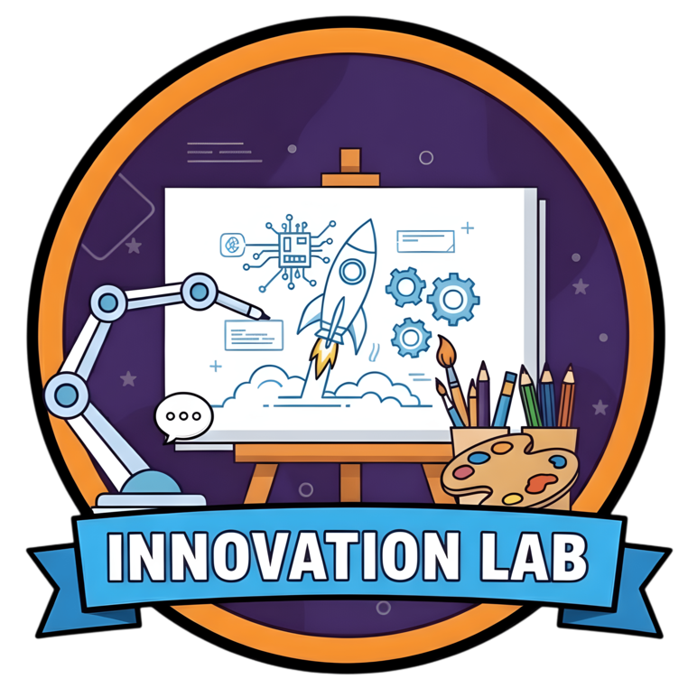<br/>
<strong>Innovation Lab</strong><br/>
Create and protect inventions
</td>
<td align="center" width="25%">
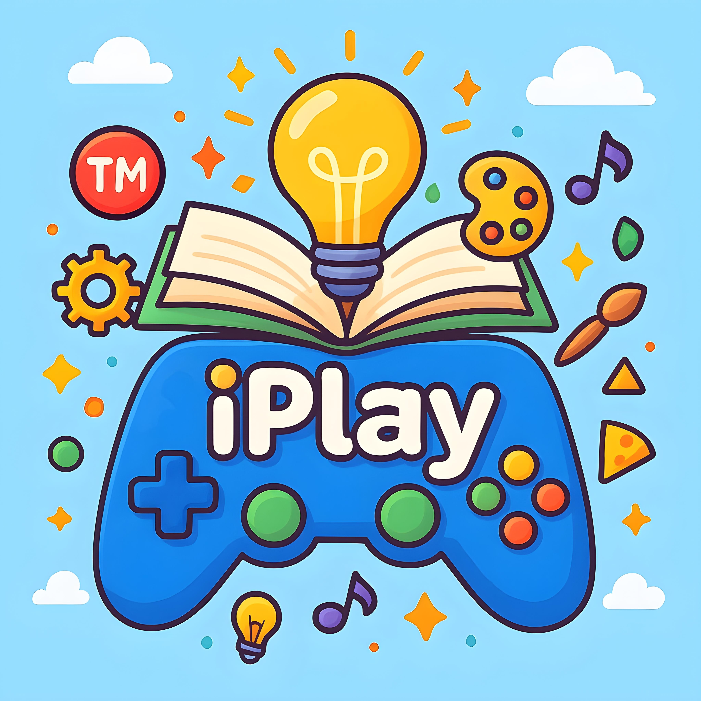<br/>
<strong>Daily Challenges</strong><br/>
Fresh content every day
</td>
</tr>
</table>

---

## ✨ Features

### 🎓 For Students

- **Progressive Learning**: 60 levels across 6 IPR realms
- **Gamification**: Earn XP, unlock 50+ badges, build streaks
- **Interactive Quizzes**: Test knowledge after each level
- **Compete**: Classroom, school, state, and national leaderboards
- **Certificates**: Earn official certificates for completing realms
- **Offline Mode**: Learn anywhere without internet

### 👨‍🏫 For Teachers

- **Classroom Management**: Create and manage multiple classrooms
- **Assignments**: Create, assign, and grade student work
- **Progress Tracking**: Real-time analytics on student performance
- **Announcements**: Communicate with entire class
- **Join Requests**: Approve students joining your classroom

### 🏫 For Schools

- **School Dashboard**: Principal oversight of all classrooms
- **Multi-Teacher Support**: Manage multiple teachers and classes
- **School Leaderboards**: Track top performers
- **Analytics**: School-wide performance metrics
- **Free Forever**: No per-student or per-school fees

---

## 🏆 Gamification System

<div align="center">

### Earn XP • Unlock Badges • Build Streaks • Earn Certificates

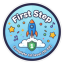
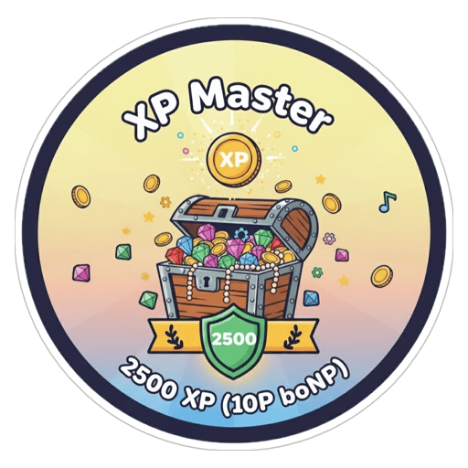

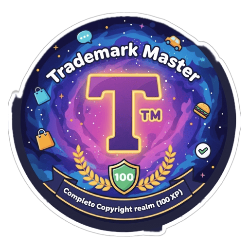
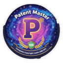
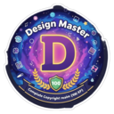

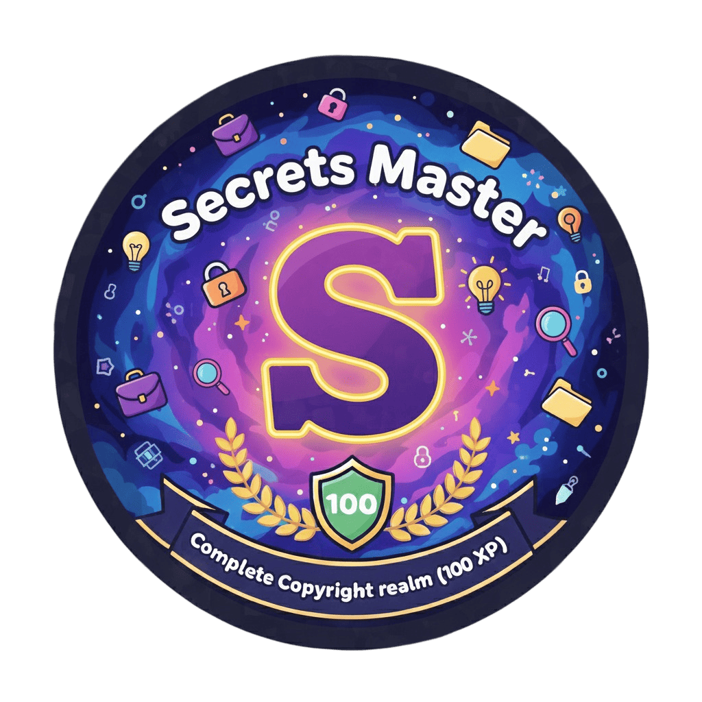
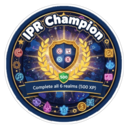
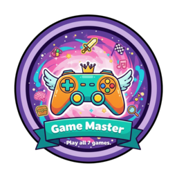
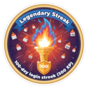


**50+ Unique Badges** across Milestone, Streak, Mastery, Social, and Special categories

</div>

**XP System:**
- Complete levels: 50-200 XP (based on difficulty)
- Daily challenges: +50 XP
- Perfect quiz scores: Bonus XP
- Daily login: +10 XP
- Streak milestones: Up to +100 XP

**Certificates:**
- PDF generation with QR codes
- Unique certificate numbers
- Download and share
- Auto-issued on realm completion

---

## 🚀 Quick Start

### For Students & Teachers

**Get Started:**

1. Download and install the app
2. Sign up with email or Google
3. Choose your role (Student/Teacher/Principal)
4. Start learning or create a classroom!

*App deployment coming soon. Star this repo for updates!*

---

### For Developers

**Prerequisites:**
- Flutter 3.0+
- Dart 3.8+
- Firebase account (free tier)

**Installation:**

```bash
# Clone the repository
git clone https://github.com/PushkarPisolkar04/iplay.git
cd iplay

# Install dependencies
flutter pub get

# Run the app
flutter run
```

**Firebase Setup:**
1. Create a Firebase project at [console.firebase.google.com](https://console.firebase.google.com)
2. Enable Authentication (Email/Password + Google Sign-In)
3. Create Firestore database
4. Download `google-services.json` to `android/app/`
5. Run `flutterfire configure`

See [PROJECT_GUIDE.md](PROJECT_GUIDE.md) for detailed setup instructions.

---

## 🛠️ Tech Stack

**Frontend:**
- Flutter 3.0+ (Cross-platform mobile)
- Provider (State management)
- Material Design 3

**Backend:**
- Firebase Authentication
- Cloud Firestore (14 collections)
- Local JSON content (offline-first)

**Why This Architecture?**
- ✅ Free forever (Firebase Spark plan)
- ✅ Fast loading (local content)
- ✅ Offline support
- ✅ Scalable to 1000+ students

---

## 🎯 What's Inside

<div align="center">

### Complete IPR Learning Platform

| Component | What You Get |
|:----------|:-------------|
| 📚 **Learning Content** | 60 comprehensive levels + 60 interactive quizzes |
| 🎮 **Games** | 7 fully-featured educational games |
| 🏆 **Rewards** | 50+ unique badges, XP system, certificates |
| 🔥 **Backend** | Firebase authentication & real-time sync |
| 📱 **Interface** | 60+ screens with Material Design 3 |
| 🏫 **School System** | Complete classroom & assignment management |
| � **AnSalytics** | Progress tracking & leaderboards |

</div>

---

## 🤝 Contributing

We welcome contributions from developers, educators, designers, and IP law experts!

**How to Contribute:**

1. Fork the repository
2. Create a feature branch: `git checkout -b feature/amazing-feature`
3. Commit your changes: `git commit -m 'Add amazing feature'`
4. Push to branch: `git push origin feature/amazing-feature`
5. Open a Pull Request

**Ways to Contribute:**
- 💻 Add new features or fix bugs
- 📚 Create additional learning content
- 🎨 Enhance UI/UX design
- 🌐 Translate to regional languages
- 🧪 Test and report issues
- 📖 Improve documentation

See [CONTRIBUTING.md](CONTRIBUTING.md) for detailed guidelines.

---

## 📄 License

This project is licensed under the MIT License - see the [LICENSE](LICENSE) file for details.

**TL;DR:** Free to use, modify, and distribute. Just give credit!

---

## � Coontact

<div align="center">

**Questions? Suggestions? Want to collaborate?**

[](https://github.com/PushkarPisolkar04/iplay/issues)
[](https://github.com/PushkarPisolkar04/iplay/discussions)
[](mailto:support@iplay.app)

</div>

---

## 🌟 Our Mission

**Making IP Rights education accessible to every Indian student.**

We believe quality education should be free, engaging, and accessible. IPlay aims to create a generation of IP-aware innovators who can protect their ideas and respect others' intellectual property.

**Join us in democratizing IPR education in India! 🚀**

---

<div align="center">


### Made with ❤️ for Indian Students

**Free Forever • Open Source • Built for Education**

---

⭐ **Star this repo if you believe in accessible education!**

[](https://github.com/PushkarPisolkar04/iplay/stargazers)
[](https://github.com/PushkarPisolkar04/iplay/network/members)
[](https://github.com/PushkarPisolkar04/iplay/watchers)

**© 2025 IPlay. Licensed under MIT. Built with Flutter & Firebase.**

</div>
