<div align="center">


# IPlay - Learn IP Rights the Fun Way! 🎮

### Making Intellectual Property Rights education accessible, engaging, and fun for every Indian student

[](https://flutter.dev/)
[](https://firebase.google.com/)
[](LICENSE)
[](https://flutter.dev/)

**🎓 85% Complete** • **🎮 7 Games Live** • **📚 60 Levels** • **📝 60 Quizzes** • **� 50 + Badges** • **🆓 Free Forever**

[🚀 Get Started](#-getting-started) • [📖 Documentation](PROJECT_GUIDE.md) • [🎮 Play Games](#-the-game-arena) • [🤝 Contribute](#-contributing)

</div>

---

## 🌟 What is IPlay?

<div align="center">

**IPlay is India's first gamified mobile learning platform for Intellectual Property Rights education.**

Transform complex legal concepts into an exciting adventure with **6 interactive realms**, **7 action-packed games**, **35+ collectible badges**, and a comprehensive learning system designed specifically for Indian students.

</div>

### 🎯 The Problem We're Solving

In today's innovation-driven economy, understanding IP rights is crucial for every student, entrepreneur, and creator. Yet:

- 📚 **IPR education is boring**: Traditional textbooks make legal concepts feel dry and inaccessible
- 🎓 **Limited curriculum integration**: Most schools don't teach IPR systematically
- 💰 **Expensive courses**: Quality IPR education is often behind paywalls
- 🌍 **Lack of practical knowledge**: Students learn theory but can't apply it to real-world scenarios
- 😴 **Low engagement**: Legal topics struggle to compete with social media and games

### 💡 Our Solution

IPlay transforms IPR education through:

- 🎮 **Gamification**: Turn learning into an addictive game with XP, badges, and leaderboards
- 🎯 **Interactive Content**: 7 engaging games that make concepts stick
- 📚 **Comprehensive Curriculum**: 6 realms covering all aspects of IPR in India
- 🏫 **School Integration**: Tools for teachers to assign, track, and grade
- 🆓 **Free Forever**: No subscriptions, no ads, no hidden costs
- 📱 **Mobile-First**: Learn anytime, anywhere, even offline

### 👥 Who It's For

<table>
<tr>
<td width="25%" align="center">
<h4>🎓 Students</h4>
<p><strong>Grades 8-12</strong></p>
<p>Learn IPR through games and challenges. Build knowledge that lasts a lifetime.</p>
</td>
<td width="25%" align="center">
<h4>👨‍🏫 Teachers</h4>
<p><strong>Educators</strong></p>
<p>Assign lessons, track progress, and engage students with gamified learning.</p>
</td>
<td width="25%" align="center">
<h4>🏫 Schools</h4>
<p><strong>Institutions</strong></p>
<p>Integrate IPR into curriculum with comprehensive management tools.</p>
</td>
<td width="25%" align="center">
<h4>📖 Self-Learners</h4>
<p><strong>Anyone</strong></p>
<p>Curious about IP rights? Learn at your own pace, completely free.</p>
</td>
</tr>
</table>

---

## 📊 By The Numbers

<div align="center">

| 📚 Learning Content | 🎮 Games & Challenges | 🏆 Rewards | 👥 Community |
|:---:|:---:|:---:|:---:|
| **6** IPR Realms | **7** Interactive Games | **50+** Unique Badges | **Multi-Level** Leaderboards |
| **60** Total Levels | **Daily** Challenges | **XP** System | **Classroom** Management |
| **60** Quizzes | **Real-World** Scenarios | **Certificates** | **School** Integration |
| **600+** Questions | **High Score** Tracking | **Streak** Rewards | **State & National** Rankings |
| **10** Levels per Realm | **30+** Brand Logos | **PDF** Certificates | **Assignment** System |

</div>

---

## 🎯 The Six IPR Realms

Embark on an epic journey through six distinct realms, each dedicated to a crucial aspect of Intellectual Property Rights. Master them all to become an IPR Champion!

<div align="center">

### 📚 Realm 1: Copyright Kingdom


**Protect Creative Expressions**

</div>

Dive into the world of creative works and learn how artists, authors, musicians, and creators protect their original expressions. From books and songs to software and films, discover the power of copyright law.

**What You'll Learn:**
- 📖 Literary works protection (books, poems, articles)
- 🎵 Musical compositions and sound recordings
- 🎬 Cinematographic films and videos
- 💻 Software and digital content rights
- 🎨 Artistic works and visual creations
- ⏰ Duration of copyright (lifetime + 60 years)
- 🔄 Fair use and exceptions
- 🌍 International copyright treaties

**Real-World Applications:** Understanding YouTube copyright claims, music licensing, book publishing rights, software piracy prevention

---

<div align="center">

### 🏷️ Realm 2: Trademark Territory


**Guard Brand Identity**

</div>

Enter the competitive world of brands and logos! Learn how companies protect their identity, prevent confusion, and build trust with consumers through trademark registration and enforcement.

**What You'll Learn:**
- 🎯 What qualifies as a trademark (logos, names, slogans)
- ✅ Registration process and requirements
- 🔍 Trademark search and clearance
- ⚖️ Infringement and passing off
- 🛡️ Famous marks and well-known trademarks
- 🔄 Renewal and maintenance
- 🌐 Madrid Protocol for international protection
- 🚫 Generic marks and loss of distinctiveness

**Real-World Applications:** Recognizing fake products, understanding brand protection, logo design considerations, domain name disputes

**Featured Brands:** Nike, Adidas, Coca-Cola, Apple, Google, Amazon, Tata, Amul, and 20+ more Indian and international brands!

---

<div align="center">

### 🔬 Realm 3: Patent Palace


**Secure Innovations**

</div>

Step into the laboratory of innovation! Discover how inventors protect their groundbreaking ideas, from life-saving medicines to revolutionary technologies. Learn the patent system that drives global innovation.

**What You'll Learn:**
- 💡 Patentability criteria (novelty, inventive step, industrial application)
- 📝 Patent application process and documentation
- 🔬 Types of patents (utility, design, plant)
- ⏳ Patent term (20 years from filing)
- 🔓 Patent disclosure and claims
- 🌍 International patent systems (PCT, Paris Convention)
- ⚖️ Patent infringement and litigation
- 🚫 Exceptions and exclusions

**Real-World Applications:** Drug patents and generic medicines, tech patents (smartphones, AI), patent trolls, prior art searches

**Case Studies:** Indian pharmaceutical patents, software patents debate, biotech innovations, green technology patents

---

<div align="center">

### 🎨 Realm 4: Design Domain


**Safeguard Aesthetics**

</div>

Explore the intersection of art and commerce! Learn how unique product designs—from smartphone shapes to furniture aesthetics—are protected under industrial design law.

**What You'll Learn:**
- 🎨 What constitutes a registrable design
- 👁️ Visual appearance vs functional features
- 📋 Design registration process
- ⏰ Protection period (10 years, extendable to 15)
- 🔄 Design vs copyright overlap
- 🌐 Hague Agreement for international designs
- ⚖️ Design infringement and remedies
- 🚫 Exclusions (functional designs, offensive designs)

**Real-World Applications:** Product packaging design, furniture aesthetics, automobile body design, smartphone appearance, fashion design protection

**Examples:** iPhone design patents, Coca-Cola bottle shape, furniture designs, automotive styling

---

<div align="center">

### 🗺️ Realm 5: GI Gateway


**Celebrate Regional Heritage**

</div>

Journey through India's rich cultural and agricultural heritage! Discover how Geographical Indications protect products unique to specific regions, preserving tradition and supporting local communities.

**What You'll Learn:**
- 🌾 What is a Geographical Indication
- 📍 Link between product quality and origin
- 🏛️ GI registration in India
- 🛡️ Protection against misuse
- 🌍 International GI systems
- 💰 Economic benefits for communities
- ⚖️ Enforcement and penalties
- 🔄 GI vs trademark differences

**Real-World Applications:** Darjeeling Tea, Basmati Rice, Mysore Silk, Kanchipuram Sarees, Alphonso Mango, Kolhapuri Chappals

**Indian GI Products:** 
- 🍵 Darjeeling Tea (West Bengal)
- 🍚 Basmati Rice (Punjab, Haryana)
- 🥭 Alphonso Mango (Maharashtra)
- 🧵 Kanchipuram Silk (Tamil Nadu)
- 👗 Mysore Silk (Karnataka)
- 👞 Kolhapuri Chappals (Maharashtra)
- 🎨 Madhubani Paintings (Bihar)
- And 300+ more registered GI products!

---

<div align="center">

### 🔐 Realm 6: Trade Secrets Sanctuary


**Master Confidential Intelligence**

</div>

Unlock the mysteries of business confidentiality! Learn how companies protect their most valuable secrets—from Coca-Cola's formula to Google's search algorithm—without public disclosure.

**What You'll Learn:**
- 🤫 What qualifies as a trade secret
- 🔒 Confidentiality measures and NDAs
- 👥 Employee obligations and non-compete clauses
- ⚖️ Trade secret misappropriation
- 🛡️ Legal protection mechanisms
- 🔄 Trade secrets vs patents (pros and cons)
- 🌐 International trade secret laws
- 💼 Corporate espionage and remedies

**Real-World Applications:** Coca-Cola formula, KFC's 11 herbs and spices, Google's search algorithm, customer databases, manufacturing processes

**Famous Trade Secrets:** Coca-Cola formula (130+ years), KFC recipe, WD-40 formula, Google PageRank algorithm, Listerine formula

---

## 🎮 The Game Arena

Learning through play! Seven action-packed games that make IPR concepts stick. Each game is designed to reinforce specific concepts while keeping you entertained.

---

<div align="center">

### 🎯 Game 1: IPR Quiz Master


**⚡ Rapid-Fire Knowledge Challenge**

</div>

Race against the clock in this adrenaline-pumping quiz game! Answer 10 challenging questions in just 60 seconds. Test your IPR knowledge across all six realms and prove you're the ultimate Quiz Master.

**Game Features:**
- ⏱️ 60-second time limit
- 🎯 10 questions per round
- 🌈 Questions from all IPR realms
- 💯 Score based on speed and accuracy
- 🏆 High score tracking
- 🎊 Confetti celebration on completion

**Skills Developed:** Quick thinking, comprehensive IPR knowledge, time management, decision-making under pressure

**Difficulty Levels:** Easy (5 pts/question) → Medium (10 pts) → Hard (15 pts) → Expert (20 pts)

---

<div align="center">

### 🃏 Game 2: Trademark Match


**🧠 Memory & Brand Recognition**

</div>

Flip cards and match famous brand logos with their company names! This memory game features 30+ real Indian and international brands. Sharpen your memory while learning to recognize authentic trademarks.

**Game Features:**
- 🎴 30+ famous brand logos (Nike, Adidas, Apple, Tata, Amul, etc.)
- 🔄 Card flip mechanics
- ⏰ Time-based scoring
- 🎯 Match pairs to win
- 🌟 Bonus points for consecutive matches
- 📊 Move counter and efficiency tracking

**Featured Brands:** Nike, Adidas, Apple, Google, Amazon, Microsoft, Coca-Cola, Pepsi, McDonald's, KFC, Starbucks, Tata, Amul, Reliance, Flipkart, Paytm, Zomato, Swiggy, and more!

**Skills Developed:** Visual memory, brand recognition, attention to detail, pattern matching

---

<div align="center">

### 🔍 Game 3: Spot the Original


**🕵️ Counterfeit Detection Challenge**

</div>

Can you tell the real from the fake? Compare side-by-side images of genuine products and counterfeits. Train your eye to spot subtle differences and protect yourself from trademark infringement!

**Game Features:**
- 👀 Side-by-side comparison
- 🎯 10 product pairs per round
- 🔍 Zoom functionality for details
- ⏱️ Time pressure for added challenge
- 💡 Hints available (with point deduction)
- 📈 Accuracy percentage tracking

**Product Categories:**
- 👟 Footwear (Nike, Adidas, Puma)
- 🍫 Food & Beverages (Coca-Cola, KitKat, Snickers)
- 🧴 Personal Care (Colgate, Melody)
- ☕ Restaurants (Starbucks, Domino's)

**Skills Developed:** Attention to detail, visual discrimination, consumer awareness, trademark infringement recognition

---

<div align="center">

### 🔬 Game 4: Patent Detective


**🔎 Investigation & Prior Art Search**

</div>

Put on your detective hat! Investigate patent applications by searching for prior art. Analyze claims, compare with existing inventions, and determine if a patent should be granted. Real patent examination experience!

**Game Features:**
- 📋 Real-world patent scenarios
- 🔍 Prior art database search
- 📊 Claim analysis tools
- ⚖️ Grant or reject decisions
- 💡 Detailed explanations
- 🎯 Multiple investigation cases

**Investigation Types:**
- 🍳 Kitchen appliances
- 📱 Mobile app interfaces
- 👟 Shoe designs
- 📦 Packaging innovations
- 🎨 Logo designs

**Skills Developed:** Critical thinking, research skills, patent claim analysis, novelty assessment, legal reasoning

---

<div align="center">

### 🗺️ Game 5: GI Mapper


**🌏 Geography Meets Heritage**

</div>

Explore India's rich cultural heritage! Match Geographical Indication products to their states of origin. From Darjeeling Tea to Mysore Silk, discover the unique products that make each Indian state special.

**Game Features:**
- 🗺️ Interactive India map
- 🎯 Drag-and-drop mechanics
- 🌾 50+ GI products
- 📍 State-wise categorization
- 📚 Product information cards
- 🏆 Regional mastery badges

**GI Categories:**
- 🍵 Beverages (Darjeeling Tea, Coorg Coffee)
- 🍚 Food (Basmati Rice, Alphonso Mango)
- 🧵 Textiles (Kanchipuram Silk, Mysore Silk)
- 🎨 Handicrafts (Madhubani Paintings, Channapatna Toys)
- 👞 Leather (Kolhapuri Chappals)

**Skills Developed:** Indian geography, cultural awareness, GI product knowledge, regional heritage appreciation

---

<div align="center">

### 🛡️ Game 6: IP Defender


**⚔️ Tower Defense Strategy**

</div>

Defend your intellectual property! Build defensive towers to stop waves of IP infringers—pirates, counterfeiters, copycats, and infringers. Strategic tower defense gameplay meets IPR education!

**Game Features:**
- 🗼 4 tower types (Copyright Shield, Patent Cannon, Trademark Barrier, Trade Secret Vault)
- 👾 4 enemy types (Pirates, Counterfeiters, Copycats, Infringers)
- 🗺️ Multiple map layouts
- 💰 Resource management
- 📈 Progressive difficulty waves
- ⚡ Special abilities and power-ups

**Tower Arsenal:**
- 🛡️ **Copyright Shield**: Blocks creative work theft
- 🔫 **Patent Cannon**: Fires innovation protection bolts
- 🚧 **Trademark Barrier**: Creates brand protection fields
- 🔐 **Trade Secret Vault**: Emits confidentiality pulses

**Enemy Types:**
- 🏴‍☠️ **Pirates**: Fast-moving copyright infringers
- 🎭 **Counterfeiters**: Trademark violators with disguises
- 🐱 **Copycats**: Design imitators
- ⚠️ **Infringers**: General IP violators

**Skills Developed:** Strategic thinking, resource management, IPR enforcement concepts, quick decision-making

---

<div align="center">

### 🧪 Game 7: Innovation Lab


**🔬 Create & Protect Your Inventions**

</div>

Become an inventor! Create your own innovations, decide how to protect them (patent, trade secret, or open source), and navigate the challenges of bringing ideas to market. Experience the full innovation lifecycle!

**Game Features:**
- 💡 Invention creation simulator
- 🤔 Protection strategy decisions
- 💰 Cost-benefit analysis
- ⏰ Time-to-market considerations
- 🌍 Market competition scenarios
- 📊 Success metrics tracking

**Decision Points:**
- Patent it (public disclosure, 20-year protection, high cost)
- Keep as trade secret (indefinite protection, risk of discovery)
- Open source (community benefit, no protection)
- Hybrid approach (patent some, secret some)

**Skills Developed:** Strategic decision-making, cost-benefit analysis, IP strategy, business acumen, innovation management

---

## 🏆 Gamification System

Stay motivated with our comprehensive reward system! Every action you take earns you something—XP, badges, certificates, or leaderboard positions.

### 💎 XP (Experience Points) System

**Earn XP for Everything:**
- 📚 Complete levels: 50-200 XP (based on difficulty)
- 🎯 Ace quizzes: Bonus XP for perfect scores
- 🎮 Play games: 30-100 XP per game
- 🌅 Daily login: +10 XP
- 🔥 Maintain streaks: Milestone bonuses up to +100 XP
- 🎯 Daily challenges: +50 XP

**Difficulty Tiers:**
- 🟢 Easy: 50 XP
- 🟡 Medium: 100 XP
- 🟠 Hard: 150 XP
- 🔴 Expert: 200 XP

**Smart XP System:**
- 📊 Daily XP cap (1000 XP) prevents grinding
- 📉 Replay reduction (100% → 25% → 10% → 0%)
- 🎁 Bonus XP for first-time completions
- ⚡ Speed bonuses for quick completions

---

### 🏅 Badge Collection (35+ Unique Badges!)

Collect badges across five categories. Each badge tells a story of your learning journey!

<div align="center">

#### 🎯 Milestone Badges (10 Badges)

 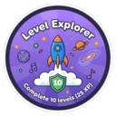 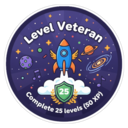 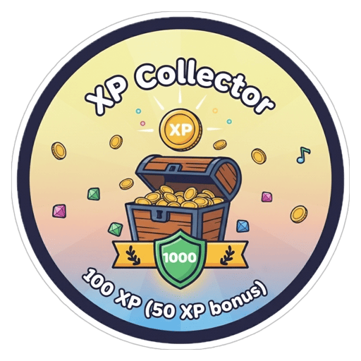 

</div>

- 🎯 **First Step**: Complete your first level
- 🗺️ **Level Explorer**: Complete 10 levels
- 🏆 **Level Veteran**: Complete 25 levels
- 💰 **XP Collector**: Earn 1,000 XP
- 💎 **XP Master**: Earn 5,000 XP
- 👑 **XP Legend**: Earn 10,000 XP
- 🌟 **XP Titan**: Earn 25,000 XP
- ✨ **Perfect Start**: Score 100% on first quiz
- 🎓 **Perfectionist**: Score 100% on 10 quizzes
- 🧠 **Quiz Genius**: Score 100% on 25 quizzes

---

<div align="center">

#### 🔥 Streak Badges (6 Badges)

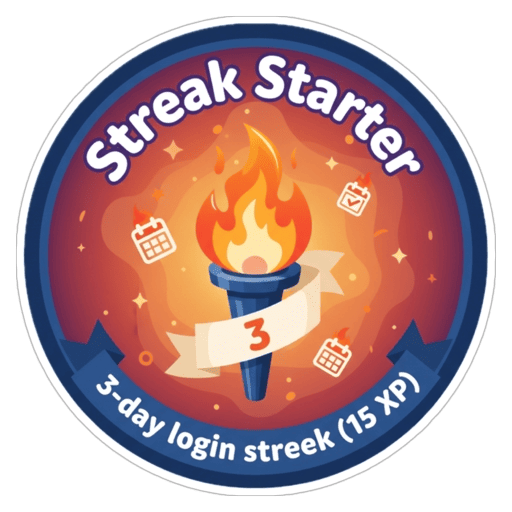 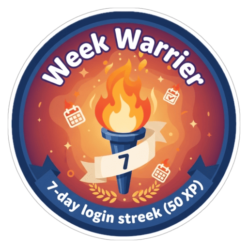 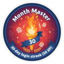 

</div>

- 🔥 **Streak Starter**: 3-day streak
- 📅 **Week Warrior**: 7-day streak
- 🗓️ **Dedicated Learner**: 14-day streak
- 📆 **Month Master**: 30-day streak
- 🎯 **Unstoppable**: 60-day streak
- 👑 **Legendary Streak**: 100-day streak

---

<div align="center">

#### 🎓 Mastery Badges (7 Badges)

      

</div>

- 📚 **Copyright Master**: Complete Copyright Realm
- 🏷️ **Trademark Master**: Complete Trademark Realm
- 🔬 **Patent Master**: Complete Patent Realm
- 🎨 **Design Master**: Complete Design Realm
- 🗺️ **GI Master**: Complete GI Realm
- 🔐 **Secrets Master**: Complete Trade Secrets Realm
- 👑 **IPR Champion**: Complete ALL realms!

---

<div align="center">

#### 👥 Social Badges (6 Badges)

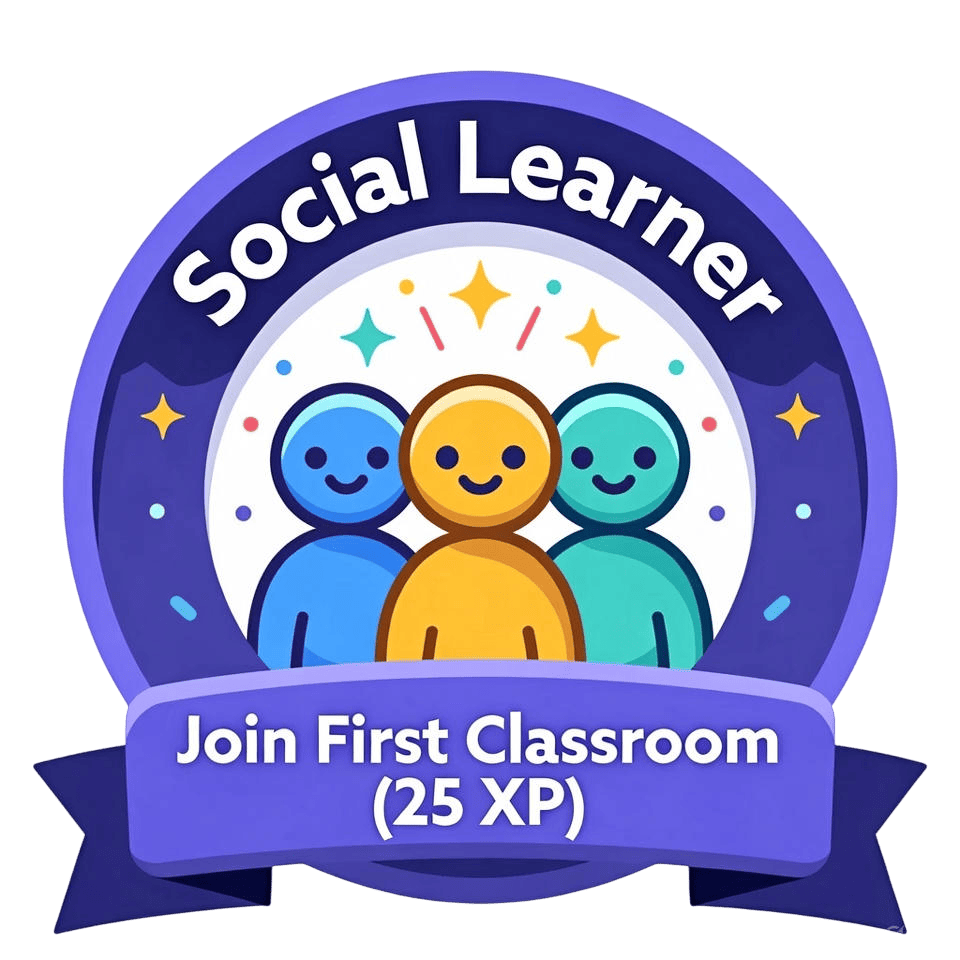  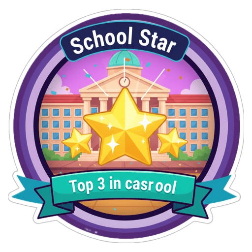 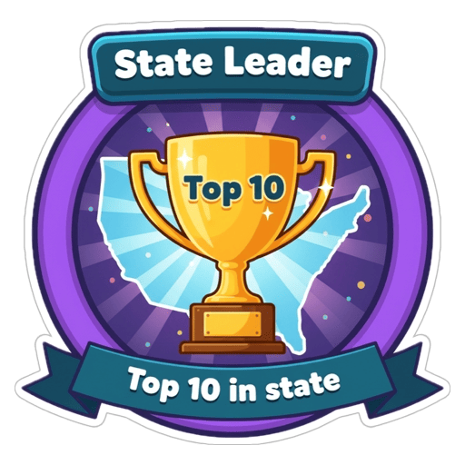

</div>

- 🏫 **Social Learner**: Join a classroom
- 🥇 **Class Champion**: Rank #1 in classroom
- ⭐ **School Star**: Rank #1 in school
- 🌟 **State Leader**: Rank #1 in state
- 📝 **Assignment Ace**: Complete 10 assignments
- 🤝 **Helpful Student**: Help 5 classmates

---

<div align="center">

#### ⚡ Special Badges (6 Badges)

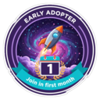 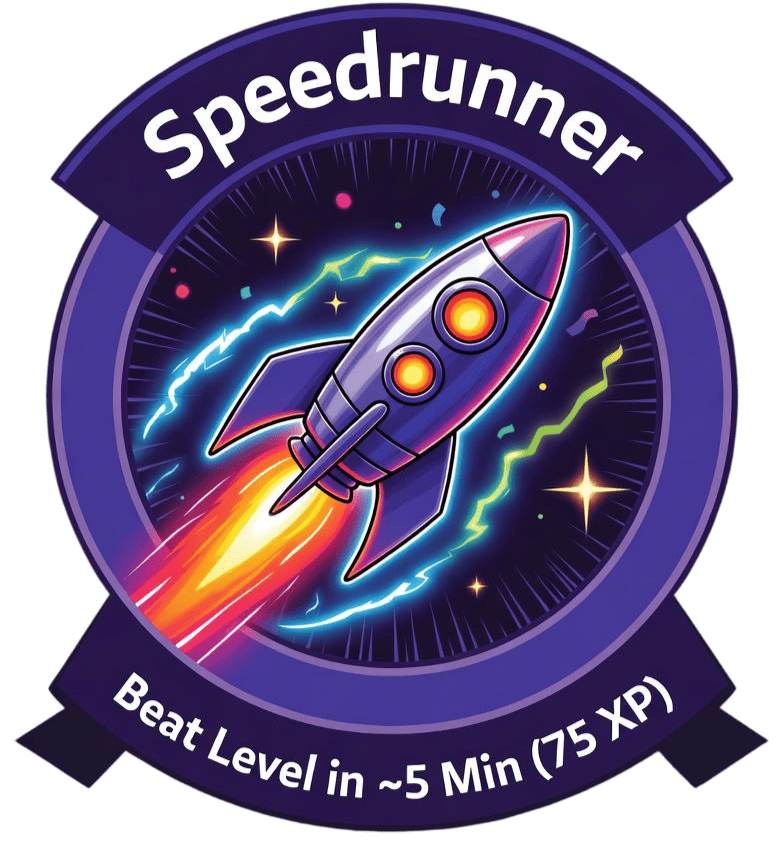 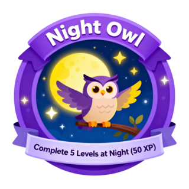  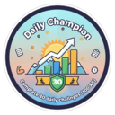

</div>

- 🚀 **Early Adopter**: Join in first month
- ⚡ **Speedrunner**: Complete level in under 5 minutes
- 🦉 **Night Owl**: Study between 10 PM - 6 AM
- 🎮 **Game Master**: Play all 7 games
- 🎯 **Daily Champion**: Complete 30 daily challenges
- 🏆 **Challenge Master**: Score 100% on 10 daily challenges

---

### 📜 Certificates

Earn official certificates for completing each realm! Each certificate includes:
- 🎓 Your name and achievement
- 📅 Completion date
- 🔢 Unique certificate number
- 📊 Your score and performance stats
- 🔐 QR code for verification
- 📥 Download as PDF
- 📤 Share on social media

---

### 🏆 Leaderboards

Compete at multiple levels:
- 🏫 **Classroom**: Beat your classmates
- 🏢 **School**: Top student in your school
- 🗺️ **State**: Best in your state
- 🇮🇳 **National**: All-India rankings
- 🎯 **Daily Challenge**: Today's top performers
- 🎮 **Game High Scores**: Game-specific rankings

## 🏫 School Management System

<div align="center">

**Complete classroom management built for Indian schools**

</div>

### For Principals 👔

- 🏢 Create and manage school profile
- 📊 View school-wide analytics
- 👥 Manage teachers and students
- 🎯 Track overall performance
- 📈 Generate reports
- 🏆 School leaderboards

### For Teachers 👨‍🏫

- 📚 Create and manage classrooms
- 🎯 Assign levels and challenges
- 📝 Create custom assignments
- ✅ Grade submissions with feedback
- 📊 Track individual student progress
- 👥 Approve join requests
- 📢 Post announcements
- 🏆 View classroom rankings

### For Students 🎓

- 🔑 Join classrooms with unique codes
- 📚 Access assigned content
- 📝 Submit assignments
- 📊 Track your progress
- 🏆 Compete on leaderboards
- 🎯 Complete daily challenges
- 🏅 Earn badges and certificates
- 👥 Collaborate with classmates

---

## 🎯 Daily Challenges

<div align="center">

**Fresh content every single day at midnight (IST)**

Never run out of things to learn! Our daily challenge system keeps you coming back.

</div>

### How It Works

- 🌅 **New Challenge Daily**: Auto-generated at 12:01 AM IST
- 🎯 **5 Questions**: Quick 5-minute challenge
- 💎 **50 XP Reward**: Bonus XP for completion
- 🎲 **One Attempt**: Make it count!
- 🏆 **Daily Leaderboard**: Compete with everyone
- 📊 **Streak Tracking**: Build your challenge streak

### Challenge Types

- 📚 Mixed realm questions
- 🎯 Themed challenges (Copyright Day, Patent Week, etc.)
- 🔥 Difficulty varies (keeps you on your toes)
- 🌟 Special event challenges
- 🎁 Bonus XP on weekends

---

## 💡 Why IPlay Works

### 🎓 For Students

<table>
<tr>
<td width="50%">

**🎮 Learning Feels Like Gaming**
- Addictive gameplay mechanics
- Instant rewards and feedback
- Visual progress tracking
- Competitive elements

**📚 Comprehensive Knowledge**
- All IPR topics covered
- Real-world case studies
- Practical applications
- Indian context and examples

</td>
<td width="50%">

**🏆 Motivation That Lasts**
- XP and level progression
- 35+ badges to collect
- Daily challenges
- Leaderboard competition

**📱 Learn Anywhere**
- Mobile-first design
- Offline capability
- Quick 5-minute sessions
- Or deep-dive learning

</td>
</tr>
</table>

---

### 👨‍🏫 For Teachers

<table>
<tr>
<td width="50%">

**⏰ Save Precious Time**
- Pre-built curriculum ready to use
- Automated grading system
- Instant progress reports
- No content creation needed

**📊 Data-Driven Teaching**
- Real-time student analytics
- Identify struggling students
- Track engagement metrics
- Performance trends

</td>
<td width="50%">

**🎯 Engage Students**
- Gamification increases participation
- Students actually want to learn
- Healthy competition
- Self-paced learning

**🛠️ Powerful Tools**
- Classroom management
- Assignment creation
- Feedback system
- Announcement board

</td>
</tr>
</table>

---

### 🏫 For Schools

<table>
<tr>
<td width="50%">

**💰 Zero Cost**
- Completely free forever
- No per-student fees
- No hidden charges
- No ads

**📈 Scalable Solution**
- Unlimited classrooms
- Unlimited students
- School-wide analytics
- Multi-teacher support

</td>
<td width="50%">

**🎓 Curriculum Ready**
- Aligned with IPR education goals
- Comprehensive coverage
- Progressive difficulty
- Assessment built-in

**🌟 Future-Ready**
- Prepare students for innovation economy
- Build IP awareness
- Practical knowledge
- Career-relevant skills

</td>
</tr>
</table>

---

## 🌍 Real-World Impact

### What Students Learn

- 🎵 **Copyright**: Understand music licensing, YouTube copyright, software piracy
- 🏷️ **Trademark**: Spot fake products, understand brand protection, logo design
- 🔬 **Patent**: Learn about drug patents, tech innovations, patent trolls
- 🎨 **Design**: Product design protection, packaging rights, aesthetic vs functional
- 🗺️ **GI**: Indian heritage products, regional specialties, cultural preservation
- 🔐 **Trade Secrets**: Business confidentiality, NDAs, competitive advantage

### Career Applications

- 💼 **Entrepreneurs**: Protect your startup's IP from day one
- 🎨 **Creators**: Understand your rights as an artist, writer, or musician
- 💻 **Developers**: Navigate software patents and open source
- 🏭 **Innovators**: Learn the patent process for your inventions
- 📱 **Digital Natives**: Understand online copyright and fair use
- 🎓 **Law Students**: Foundation for IP law specialization

---

## ✨ Key Features Showcase

<div align="center">

### 🎯 What Makes IPlay Special

</div>

<table>
<tr>
<td width="33%" align="center">
<h3>🎮 Gamified Learning</h3>

<p><strong>Learn through play</strong></p>
<p>7 interactive games that make IPR concepts stick. From quiz challenges to tower defense, learning has never been this fun!</p>
</td>
<td width="33%" align="center">
<h3>🏆 Reward System</h3>

<p><strong>Every action counts</strong></p>
<p>Earn XP, unlock 35+ badges, build streaks, and earn certificates. Stay motivated with visible progress!</p>
</td>
<td width="33%" align="center">
<h3>📚 Complete Curriculum</h3>
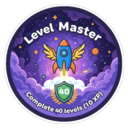
<p><strong>All IPR topics covered</strong></p>
<p>6 comprehensive realms with 42 levels covering every aspect of Indian IP law. From basics to expert!</p>
</td>
</tr>
<tr>
<td width="33%" align="center">
<h3>🏫 School Integration</h3>

<p><strong>Built for classrooms</strong></p>
<p>Complete management system for principals, teachers, and students. Assignments, grading, analytics—all included!</p>
</td>
<td width="33%" align="center">
<h3>🎯 Daily Challenges</h3>

<p><strong>Fresh content daily</strong></p>
<p>New challenge every day at midnight. Build your streak, compete on leaderboards, earn bonus XP!</p>
</td>
<td width="33%" align="center">
<h3>📱 Offline Ready</h3>

<p><strong>Learn anywhere</strong></p>
<p>All content stored locally. No internet? No problem! Learn on the go without data charges.</p>
</td>
</tr>
<tr>
<td width="33%" align="center">
<h3>🇮🇳 India-Focused</h3>

<p><strong>Made for India</strong></p>
<p>Indian case studies, GI products, local brands, and examples relevant to Indian students and laws.</p>
</td>
<td width="33%" align="center">
<h3>🆓 Free Forever</h3>

<p><strong>No hidden costs</strong></p>
<p>Completely free. No subscriptions, no ads, no paywalls. Quality education accessible to everyone!</p>
</td>
<td width="33%" align="center">
<h3>📊 Analytics</h3>
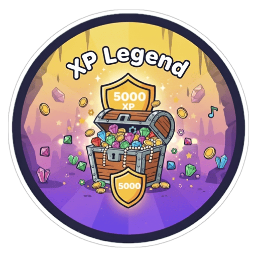
<p><strong>Track everything</strong></p>
<p>Detailed progress tracking, performance analytics, time spent, accuracy rates, and improvement trends.</p>
</td>
</tr>
</table>

---

## 🛠️ Technology Stack

<div align="center">

**Built with modern, battle-tested technologies for reliability and performance**

</div>

### Frontend

<table>
<tr>
<td width="50%">

**🎨 Framework & UI**
- **Flutter 3.0+**: Cross-platform mobile framework
- **Material Design 3**: Modern, beautiful UI
- **Custom Animations**: Smooth, engaging interactions
- **Responsive Design**: Works on all screen sizes

**📦 State Management**
- **Provider**: Efficient state management
- **Local Storage**: Offline data persistence
- **Cache Management**: Fast content loading

</td>
<td width="50%">

**🎮 Game Engines**
- **Custom Game Logic**: Built from scratch
- **Physics Simulation**: For tower defense
- **Animation System**: Confetti, transitions
- **Sound Effects**: Audio feedback

**📱 Platform Features**
- **Android & iOS**: Native performance
- **Push Notifications**: Daily reminders
- **Deep Linking**: Direct content access
- **Share Integration**: Social sharing

</td>
</tr>
</table>

### Backend

<table>
<tr>
<td width="50%">

**🔥 Firebase Services**
- **Authentication**: Email + Google Sign-In
- **Firestore**: Real-time database
- **Cloud Messaging**: Push notifications
- **Analytics**: Usage tracking
- **Crashlytics**: Error monitoring

**🔒 Security**
- **Row-level security**: Firestore rules
- **Email verification**: Required
- **Data encryption**: In transit and at rest
- **App Check**: Bot protection

</td>
<td width="50%">

**📚 Content Architecture**
- **Local JSON**: All educational content
- **Bundled Assets**: Images, icons, fonts
- **Version Control**: Content updates via app
- **No CMS**: Simple, fast, free

**⚡ Performance**
- **Offline-First**: Works without internet
- **Fast Loading**: Local content = instant
- **Efficient Sync**: Only user data synced
- **Low Bandwidth**: Minimal data usage

</td>
</tr>
</table>

### Why This Architecture?

✅ **Free Forever**: Stays within Firebase Spark (free) plan limits  
✅ **Fast Performance**: Local content loads instantly  
✅ **Offline Support**: Learn without internet connection  
✅ **Scalable**: Can handle 1000+ students per school  
✅ **Reliable**: Battle-tested technologies  
✅ **Maintainable**: Simple architecture, easy to update  

---

## 📱 Screenshots & Visuals

<div align="center">

### 🎮 Game Previews

<table>
<tr>
<td align="center" width="25%">
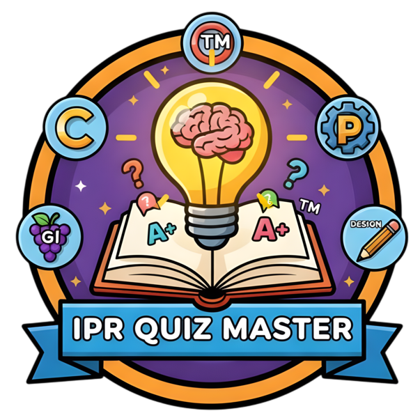<br/>
<strong>Quiz Master</strong><br/>
Rapid-fire challenges
</td>
<td align="center" width="25%">
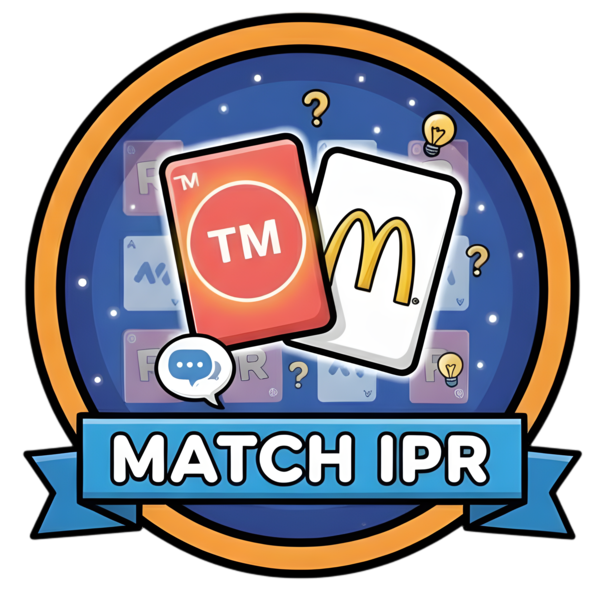<br/>
<strong>Trademark Match</strong><br/>
Memory card game
</td>
<td align="center" width="25%">
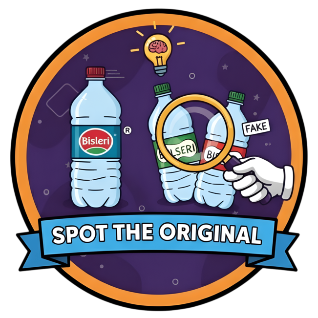<br/>
<strong>Spot Original</strong><br/>
Counterfeit detection
</td>
<td align="center" width="25%">
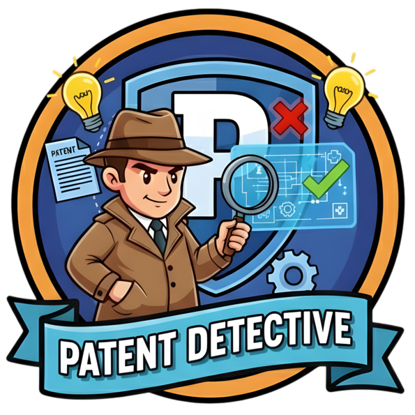<br/>
<strong>Patent Detective</strong><br/>
Prior art search
</td>
</tr>
<tr>
<td align="center" width="25%">
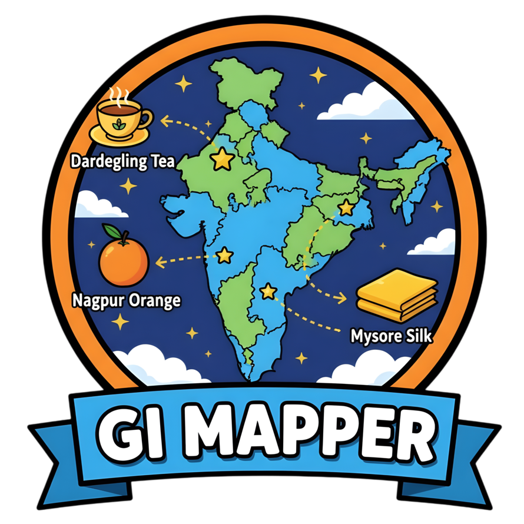<br/>
<strong>GI Mapper</strong><br/>
Geography challenge
</td>
<td align="center" width="25%">
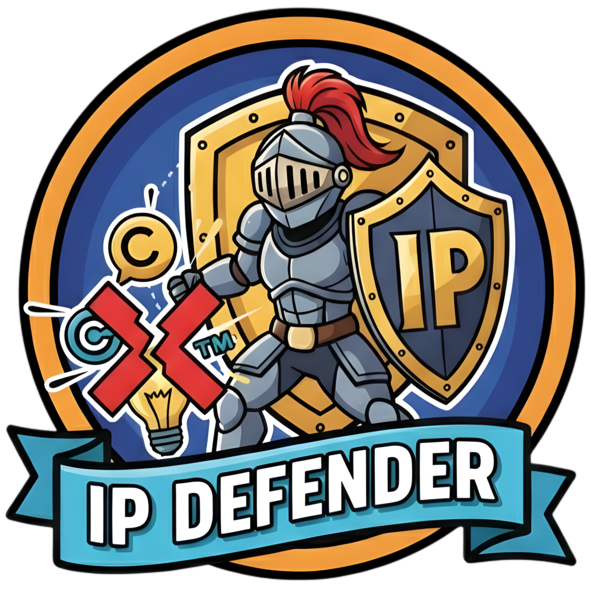<br/>
<strong>IP Defender</strong><br/>
Tower defense
</td>
<td align="center" width="25%">
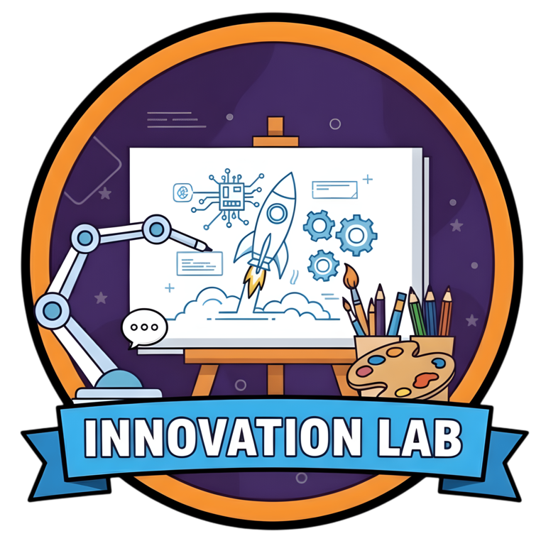<br/>
<strong>Innovation Lab</strong><br/>
Strategy simulator
</td>
<td align="center" width="25%">
<br/>
<strong>IPlay App</strong><br/>
Main platform
</td>
</tr>
</table>

### 🏆 Badge Collection Preview

<p>


</p>

*Just a preview—35+ unique badges to collect!*

### 🎨 Tower Defense Assets

<table>
<tr>
<td align="center" width="25%">
<br/>
<strong>Copyright Shield</strong>
</td>
<td align="center" width="25%">
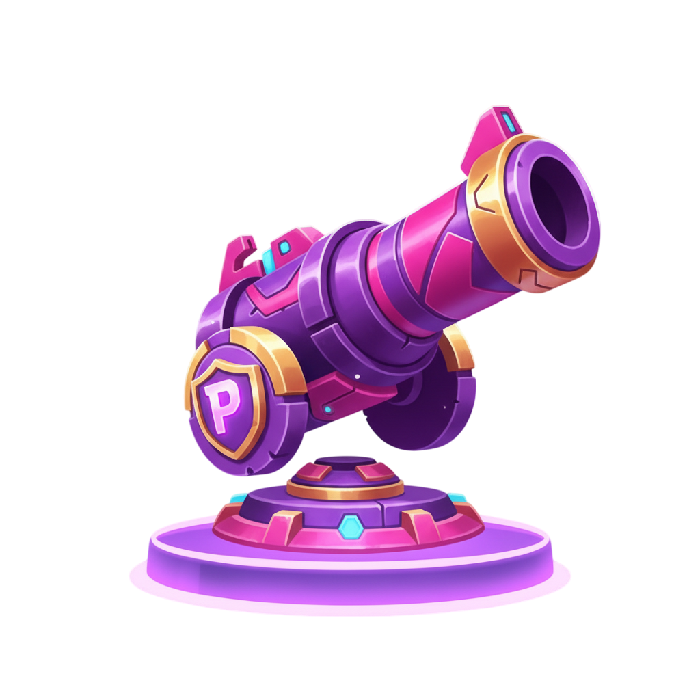<br/>
<strong>Patent Cannon</strong>
</td>
<td align="center" width="25%">
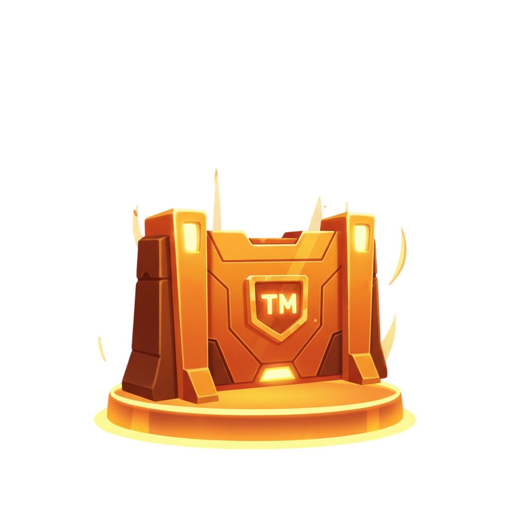<br/>
<strong>Trademark Barrier</strong>
</td>
<td align="center" width="25%">
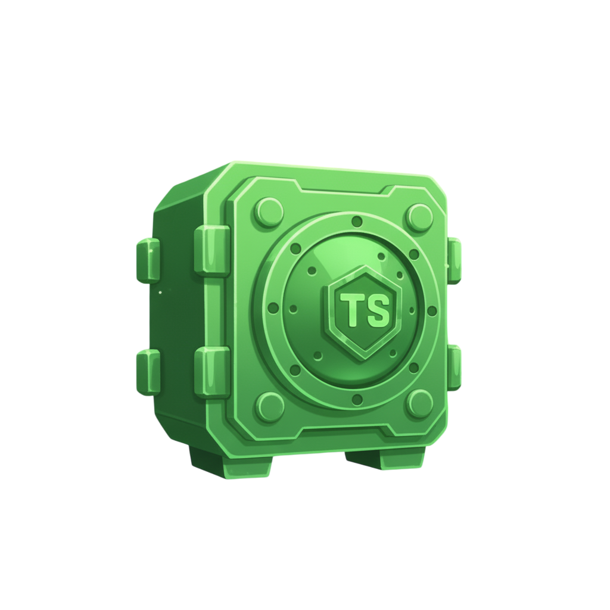<br/>
<strong>Secret Vault</strong>
</td>
</tr>
</table>

<table>
<tr>
<td align="center" width="25%">
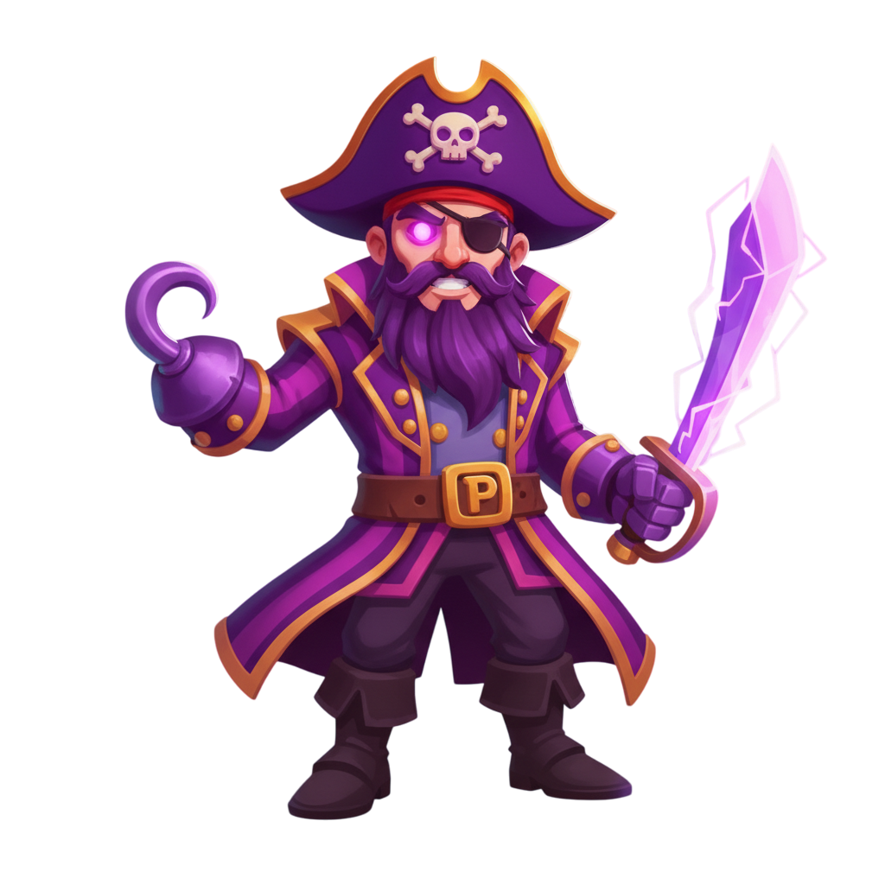<br/>
<strong>Pirate</strong><br/>
Copyright infringer
</td>
<td align="center" width="25%">
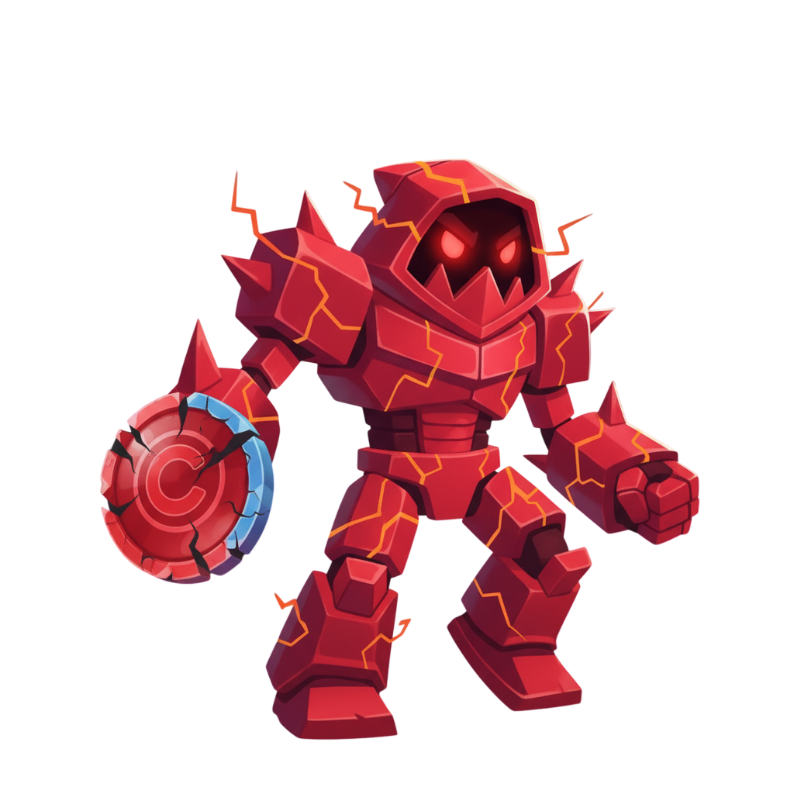<br/>
<strong>Counterfeiter</strong><br/>
Trademark violator
</td>
<td align="center" width="25%">
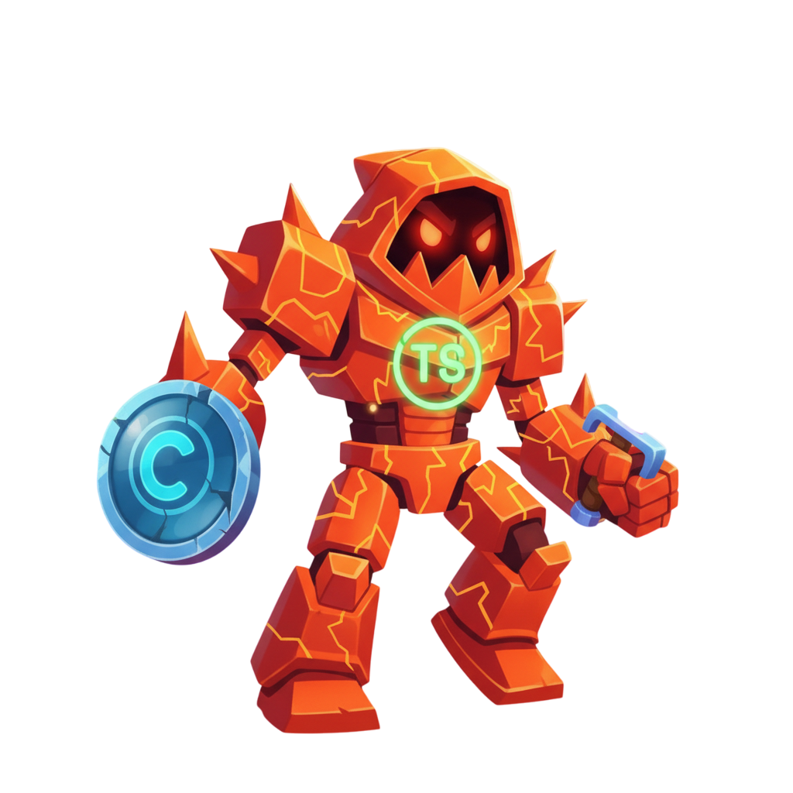<br/>
<strong>Copycat</strong><br/>
Design imitator
</td>
<td align="center" width="25%">
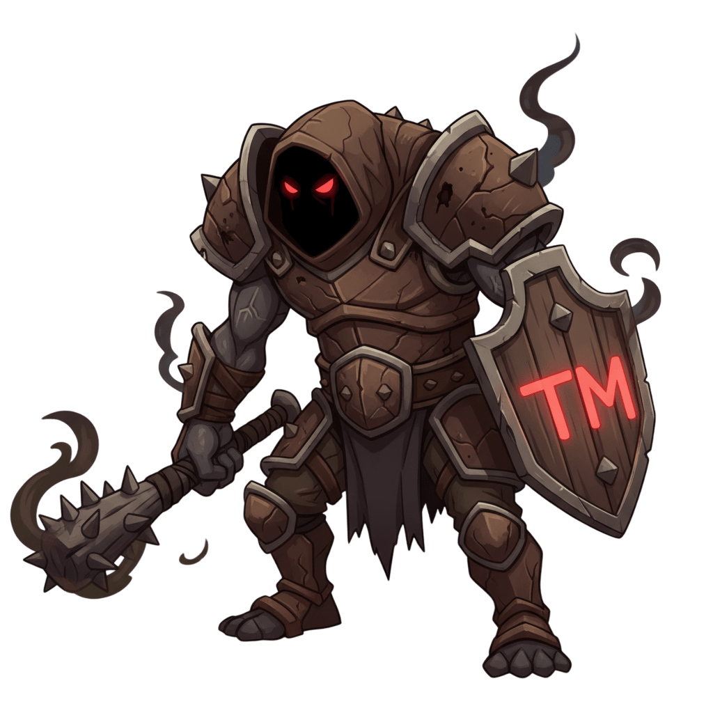<br/>
<strong>Infringer</strong><br/>
General violator
</td>
</tr>
</table>

</div>

---

## � Peroject Statistics

<div align="center">

| Category | Count | Status |
|:---------|:-----:|:------:|
| 📚 **Total Levels** | 42 | 🟡 17% Complete |
| 🎮 **Games** | 7 | ✅ 100% Complete |
| 🏆 **Badges** | 35+ | ✅ 100% Complete |
| 🎯 **Quiz Questions** | 300+ | 🟡 In Progress |
| 🗺️ **GI Products** | 50+ | ✅ Complete |
| 🏷️ **Brand Logos** | 30+ | ✅ Complete |
| 👥 **Student Avatars** | 16 | ✅ Complete |
| 👨‍🏫 **Teacher Avatars** | 16 | ✅ Complete |
| 📱 **Screens** | 50+ | 🟡 77% Complete |
| 🔥 **Firebase Collections** | 14 | ✅ 100% Complete |
| 📦 **Flutter Packages** | 40+ | ✅ Integrated |
| 🎨 **Custom Assets** | 200+ | ✅ Complete |

**Overall Progress**: 🎯 **65% Complete** (70/108 tasks)

</div>

---

## 🚀 Quick Start Guide

<div align="center">

### For Students & Teachers

**Download the app and start learning in 3 simple steps!**

</div>

### 📱 Installation (Coming Soon)

```
1. Download from Play Store / App Store
2. Sign up with email or Google
3. Choose your role (Student/Teacher/Principal)
4. Start learning!
```

*App is currently in development. Star this repo to get notified when it launches!*

---

<div align="center">

### For Developers

**Want to contribute or run IPlay locally?**

</div>

### 🛠️ Prerequisites

Before you begin, ensure you have:

- ✅ **Flutter SDK** (3.0 or higher) - [Install Flutter](https://flutter.dev/docs/get-started/install)
- ✅ **Dart SDK** (3.8 or higher) - Comes with Flutter
- ✅ **Android Studio** or **VS Code** - Your preferred IDE
- ✅ **Git** - For version control
- ✅ **Firebase Account** - Free tier is sufficient

### 📥 Installation Steps

**1. Clone the Repository**
```bash
git clone https://github.com/PushkarPisolkar04/iplay.git
cd iplay
```

**2. Install Dependencies**
```bash
flutter pub get
```

**3. Set Up Firebase** 🔥

IPlay uses Firebase for authentication and data sync. You'll need to:

- Create a Firebase project at [console.firebase.google.com](https://console.firebase.google.com)
- Enable **Authentication** (Email/Password + Google Sign-In)
- Create a **Firestore Database** (start in test mode)
- Download configuration files:
  - `google-services.json` → Place in `android/app/`
  - `GoogleService-Info.plist` → Place in `ios/Runner/`
- Run `flutterfire configure` to generate `firebase_options.dart`

**4. Configure Firestore**
```bash
# Deploy security rules
firebase deploy --only firestore:rules

# Deploy indexes
firebase deploy --only firestore:indexes
```

**5. Run the App** 🚀
```bash
# Check connected devices
flutter devices

# Run on connected device
flutter run

# Or run in debug mode
flutter run --debug

# Or build release APK
flutter build apk --release
```

### 🔧 Development Commands

```bash
# Run tests
flutter test

# Check for issues
flutter analyze

# Format code
flutter format .

# Clean build
flutter clean && flutter pub get

# Generate code (if using code generation)
flutter pub run build_runner build --delete-conflicting-outputs
```

### 📁 Project Structure Overview

```
iplay/
├── lib/
│   ├── core/              # Core functionality
│   │   ├── models/        # Data models
│   │   ├── services/      # Business logic
│   │   ├── providers/     # State management
│   │   └── constants/     # App constants
│   ├── screens/           # UI screens
│   ├── widgets/           # Reusable widgets
│   └── main.dart          # App entry point
├── assets/                # Images, fonts, content
│   ├── logos/            # Realm & game logos
│   ├── badges/           # Badge images
│   ├── games/            # Game assets
│   └── content/          # JSON content files
├── android/              # Android-specific code
├── ios/                  # iOS-specific code
├── functions/            # Cloud Functions (optional)
└── docs/                 # Documentation
```

### 🐛 Troubleshooting

**Issue: Firebase configuration not found**
```bash
# Solution: Run flutterfire configure
flutterfire configure
```

**Issue: Build fails on Android**
```bash
# Solution: Clean and rebuild
cd android
./gradlew clean
cd ..
flutter clean
flutter pub get
flutter run
```

**Issue: iOS build fails**
```bash
# Solution: Update pods
cd ios
pod install --repo-update
cd ..
flutter run
```

### 📚 Documentation

For detailed documentation, see:
- 📖 [PROJECT_GUIDE.md](PROJECT_GUIDE.md) - Complete project documentation
- 🏗️ [IMPLEMENTATION_PROGRESS.md](IMPLEMENTATION_PROGRESS.md) - Development progress
- 🚀 [DEPLOYMENT_GUIDE.md](DEPLOYMENT_GUIDE.md) - Deployment instructions
- 📝 [CONTRIBUTING.md](CONTRIBUTING.md) - Contribution guidelines

### 💡 First-Time Setup Tips

1. **Populate Badges**: Run badge population script once
2. **Test with Sample Data**: Create test users for each role
3. **Check Firebase Console**: Verify data is syncing correctly
4. **Test Offline Mode**: Disable internet and test functionality
5. **Review Security Rules**: Ensure proper access control

---

## 🗺️ Roadmap

<div align="center">

**Our journey to becoming India's #1 IPR learning platform**

</div>

### ✅ Phase 1: Foundation (Complete)

- [x] 🔐 Authentication system (Email + Google)
- [x] 📊 Database architecture (14 Firestore collections)
- [x] 💎 XP and badge system
- [x] 🏫 School/classroom management
- [x] 📝 Assignment system
- [x] 🏆 Leaderboard system
- [x] 🎯 Daily challenges
- [x] 📜 Certificate generation

### � Pthase 2: Content Creation (Complete)

- [x] ✅ **Copyright Realm** (10 levels + 10 quizzes)
- [x] ✅ **Trademark Realm** (10 levels + 10 quizzes)
- [x] ✅ **Patent Realm** (10 levels + 10 quizzes)
- [x] ✅ **Industrial Design Realm** (10 levels + 10 quizzes)
- [x] ✅ **GI Realm** (10 levels + 10 quizzes)
- [x] ✅ **Trade Secrets Realm** (10 levels + 10 quizzes)
- [x] 🎉 **Total: 60 levels + 60 quizzes = 120 content pieces!**

### ✅ Phase 3: Games (Complete)

- [x] 🎯 IPR Quiz Master
- [x] 🃏 Trademark Match
- [x] 🔍 Spot the Original
- [x] 🔬 Patent Detective
- [x] 🗺️ GI Mapper
- [x] 🛡️ IP Defender
- [x] 🧪 Innovation Lab
- [x] 🎊 Confetti animations
- [x] 📊 High score tracking

### 🚀 Phase 4: Enhancement (Upcoming)

- [ ] 🌐 Regional language support (Hindi, Tamil, Telugu, Bengali)
- [ ] 🎥 Video lessons for each level
- [ ] 🎙️ Audio narration option
- [ ] 🤖 AI-powered doubt resolution
- [ ] 📱 Progressive Web App (PWA)
- [ ] 🎮 Multiplayer game modes
- [ ] 🏆 National tournaments
- [ ] 📊 Advanced analytics dashboard

### 🌟 Phase 5: Scale (Future)

- [ ] 🌍 International expansion (other countries' IP laws)
- [ ] 🎓 College-level advanced courses
- [ ] 💼 Professional certification programs
- [ ] 🤝 Partnership with law schools
- [ ] 📚 Content creator tools
- [ ] 🎯 Corporate training modules
- [ ] 🏛️ Government collaboration
- [ ] 📱 Smart TV and tablet apps

---

## 🤝 Contributing

<div align="center">

**Join us in making IPR education accessible to every Indian student!**

We welcome contributions from everyone—developers, educators, designers, IP law experts, and students!

</div>

### 🎯 How You Can Contribute

<table>
<tr>
<td width="33%">

**💻 Developers**
- Fix bugs and issues
- Add new features
- Improve performance
- Write tests
- Enhance UI/UX
- Optimize code

</td>
<td width="33%">

**📚 Educators**
- Create learning content
- Write quiz questions
- Develop case studies
- Review accuracy
- Suggest improvements
- Test with students

</td>
<td width="33%">

**🎨 Designers**
- Design new badges
- Create game assets
- Improve UI/UX
- Design certificates
- Create illustrations
- Enhance visuals

</td>
</tr>
<tr>
<td width="33%">

**⚖️ IP Law Experts**
- Review legal accuracy
- Provide case studies
- Update content
- Answer questions
- Suggest topics
- Validate information

</td>
<td width="33%">

**🌐 Translators**
- Translate to Hindi
- Translate to regional languages
- Localize content
- Cultural adaptation
- Review translations
- Maintain glossaries

</td>
<td width="33%">

**🎮 Gamers**
- Test games
- Report bugs
- Suggest features
- Balance gameplay
- Create levels
- Provide feedback

</td>
</tr>
</table>

### 🚀 Getting Started with Contributing

1. **Fork the repository**
2. **Clone your fork**: `git clone https://github.com/PushkarPisolkar04/iplay.git`
3. **Create a branch**: `git checkout -b feature/amazing-feature`
4. **Make your changes**
5. **Test thoroughly**
6. **Commit**: `git commit -m 'Add amazing feature'`
7. **Push**: `git push origin feature/amazing-feature`
8. **Open a Pull Request**

See [CONTRIBUTING.md](CONTRIBUTING.md) for detailed guidelines.

---

## 📄 License

<div align="center">

**MIT License - Free to use, modify, and distribute**

This project is licensed under the MIT License, making it truly open source. You can use it for personal projects, educational purposes, or even commercial applications. See the [LICENSE](LICENSE) file for full details.

**TL;DR**: Do whatever you want with this code, just give credit! 🎉

</div>

---

## 📧 Get in Touch

<div align="center">

**We'd love to hear from you!**

</div>

<table>
<tr>
<td width="33%" align="center">

**🐛 Found a Bug?**

[Report an Issue](https://github.com/PushkarPisolkar04/iplay/issues)

Help us improve by reporting bugs and issues

</td>
<td width="33%" align="center">

**💡 Have an Idea?**

[Start a Discussion](https://github.com/PushkarPisolkar04/iplay/discussions)

Share feature requests and suggestions

</td>
<td width="33%" align="center">

**📧 General Inquiry?**

[Email Us](mailto:support@iplay.app)

Questions, partnerships, or just say hi!

</td>
</tr>
</table>

### 🌐 Connect With Us

<div align="center">

[](https://github.com/PushkarPisolkar04/iplay)
[](mailto:support@iplay.app)
[](PROJECT_GUIDE.md)

</div>

---

## 🙏 Acknowledgments

<div align="center">

**IPlay stands on the shoulders of giants**

</div>

We're grateful to:

- 🦋 **Flutter Team**: For the amazing cross-platform framework
- 🔥 **Firebase Team**: For reliable backend services
- ⚖️ **IP Law Educators**: For guidance on content accuracy
- 🎓 **Beta Testers**: Students and teachers who provided invaluable feedback
- 🌟 **Open Source Community**: For countless libraries and tools
- 🇮🇳 **Indian IP Office**: For comprehensive IP law resources
- 👥 **Contributors**: Everyone who has contributed code, content, or ideas
- ❤️ **You**: For believing in accessible education

---

## 🌟 Our Vision

<div align="center">


### **Making IP Rights Education Accessible to Every Indian Student**

</div>

In a world driven by innovation and creativity, understanding intellectual property rights is no longer optional—it's essential. Yet, quality IPR education remains inaccessible to most students due to cost, complexity, and lack of engaging content.

**IPlay changes that.**

We believe that:
- 🎓 **Education should be free**: No student should be denied knowledge due to financial constraints
- 🎮 **Learning should be fun**: Complex topics become simple when presented through games
- 🌍 **Knowledge should be accessible**: Mobile-first, offline-capable, available to everyone
- 🇮🇳 **Content should be relevant**: Indian context, Indian examples, Indian laws
- 🏆 **Progress should be rewarding**: Every step forward deserves recognition

### Our Goal

**Reach 1 million Indian students by 2026** and create a generation of IP-aware innovators who can:
- Protect their creative works and innovations
- Respect others' intellectual property
- Navigate the IP system confidently
- Build successful careers in the innovation economy

### Join Our Mission

Whether you're a student, teacher, developer, or IP enthusiast—you can help make this vision a reality. Star this repo, contribute code, create content, or simply spread the word.

**Together, we can democratize IPR education in India! 🚀**

---

<div align="center">


### Made with ❤️ for Indian Students Learning IP Rights

**Free Forever • Open Source • Built for Education**

---

**⭐ Star this repo if you believe in accessible education!**

**🔔 Watch for updates • 🍴 Fork to contribute • 📢 Share with others**

---

[](https://github.com/PushkarPisolkar04/iplay/stargazers)
[](https://github.com/PushkarPisolkar04/iplay/network/members)
[](https://github.com/PushkarPisolkar04/iplay/watchers)

**© 2025 IPlay. Licensed under MIT. Built with Flutter & Firebase.**

</div>
