<div align="center">


# 🎮 IPlay

### Learn Intellectual Property Rights the Fun Way!

[](https://flutter.dev)
[](https://firebase.google.com)
[](LICENSE)
[](https://www.android.com)

**Transform complex IP law into an exciting learning adventure** 🚀

[Features](#-features) • [Screenshots](#-screenshots) • [Download](#-download) • [Tech Stack](#-tech-stack)

</div>

---

## 🌟 About IPlay

IPlay is an **interactive gamified learning platform** that makes understanding Intellectual Property Rights engaging and fun. Students explore 6 different IP realms, complete challenges, earn badges, and unlock premium certificates while teachers and principals monitor progress through comprehensive analytics.

### 🎯 Why IPlay?

✨ **Gamified Learning** - Turn boring IP law into exciting games  
🏆 **Premium Certificates** - Beautiful certificates with QR verification  
📱 **Works Offline** - Learn anywhere, anytime  
📊 **Detailed Reports** - PDF, CSV, Excel with enhanced data  
🎓 **Multi-Role** - Student, Teacher, Principal support  
🔒 **Secure & Private** - Firebase-powered backend  
📱 **Android Platform** - Optimized for Android devices

---

## ✨ Features

<div align="center">

### 👨‍🎓 For Students

 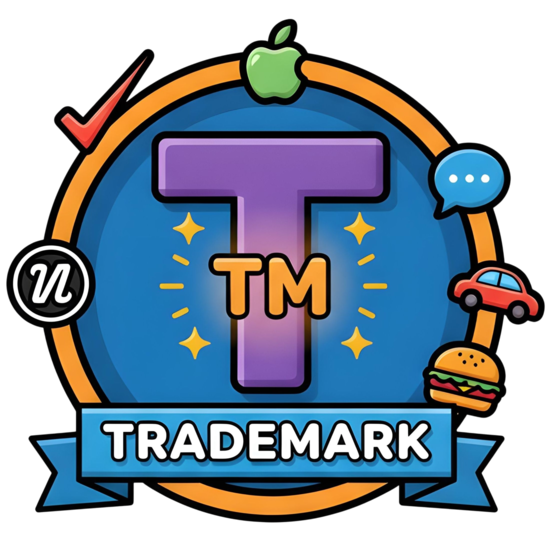   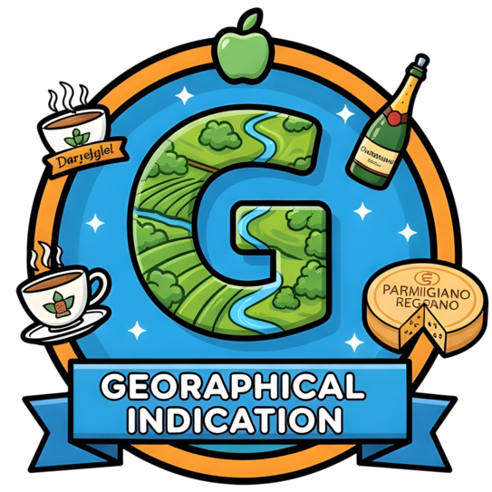 

</div>

#### 📚 **6 IP Realms to Master**
- **Copyright** - Protect creative works
- **Trademark** - Brand identity protection
- **Patent** - Innovation protection
- **Industrial Design** - Design rights
- **Geographical Indications** - Origin-based products
- **Trade Secrets** - Confidential information

#### 🎮 **Interactive Learning**
- **10 Levels per Realm** with progressive difficulty
- **Interactive Games & Quizzes** for engaging learning
- **XP & Leveling System** to track your progress
- **Badge Collection** for achievements
- **Streak Tracking** to maintain consistency
- **Leaderboards** to compete with peers

#### 🏆 **Premium Certificates**
- Beautiful gradient designs with decorative elements
- Realm-specific branding and colors
- QR code verification for authenticity
- Download and share your achievements
- Professional PDF format

<div align="center">

### 👨‍🏫 For Teachers

</div>

#### 🏫 **Classroom Management**
- Create and manage multiple classrooms
- Share classroom codes with students
- Post announcements and updates
- Monitor student progress in real-time
- Chat with students directly

#### 📊 **Enhanced Analytics & Reports**
- Track student XP, badges, and completion rates
- **Detailed PDF Reports** with performance summaries
- **Enhanced CSV/Excel** with completed levels, average scores
- **Top 5 Performers** ranking in classroom reports
- **Class Statistics** - total & average metrics
- Export in **PDF, CSV, or Excel** format
- Choose where to save your files
- Visualize classroom performance

#### 📝 **Student Monitoring**
- View all students and their progress
- Track realm completion
- Monitor daily activity and streaks
- Verify student certificates
- Filter deleted students automatically

<div align="center">

### 🏫 For Principals

</div>

#### 📈 **School-Wide Analytics**
- Monitor entire institution performance
- Compare multiple classrooms
- Track teacher activity
- View school-wide statistics
- **Detailed comparison reports**

#### 📋 **Advanced Reporting**
- School-wide performance reports
- Classroom comparison reports
- Student progress reports
- **Enhanced data exports** with detailed metrics
- Export in multiple formats (PDF/CSV/Excel)
- All reports include comprehensive statistics

---

## 📸 Screenshots

<div align="center">

### 👨‍🎓 Student Experience

</div>

<table>
  <tr>
    <td>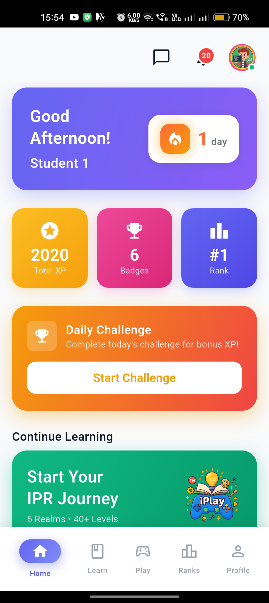<br/><b>Dashboard</b></td>
    <td>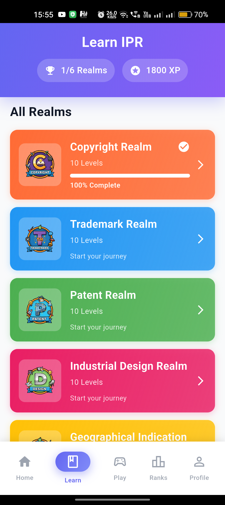<br/><b>6 IP Realms</b></td>
    <td>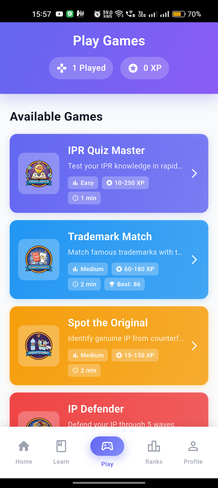<br/><b>Interactive Quizzes</b></td>
  </tr>
  <tr>
    <td>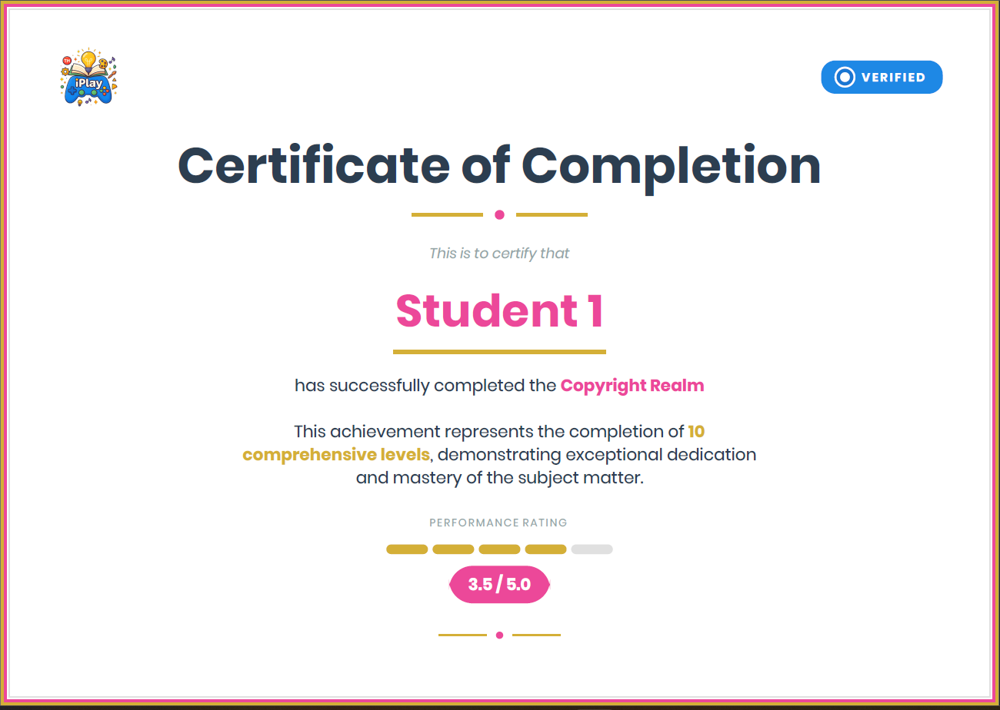<br/><b>Premium Certificates</b></td>
    <td>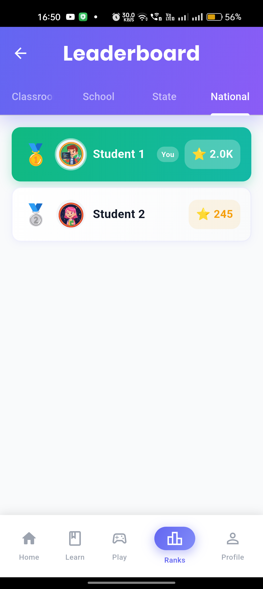<br/><b>Leaderboards</b></td>
    <td>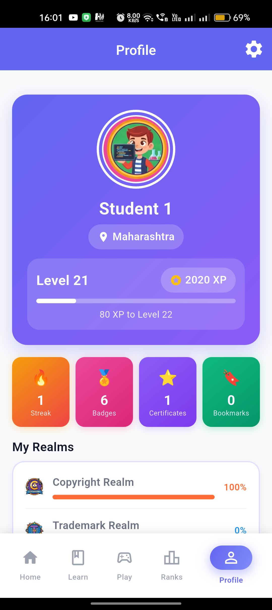<br/><b>Student Profile</b></td>
    <td>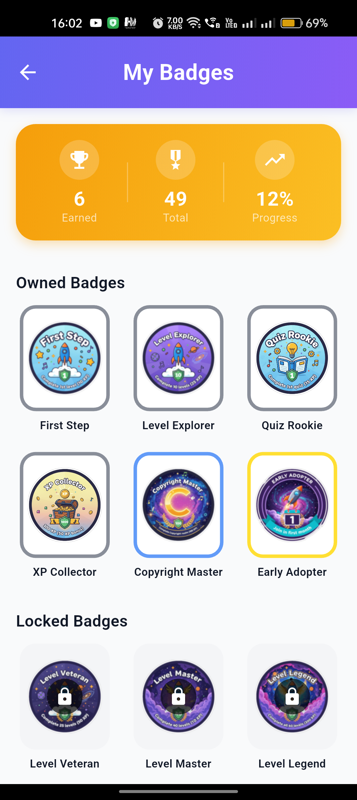<br/><b>Student Badges</b></td>
  </tr>
</table>

<div align="center">

### 👨‍🏫 Teacher Experience

</div>

<table>
  <tr>
    <td>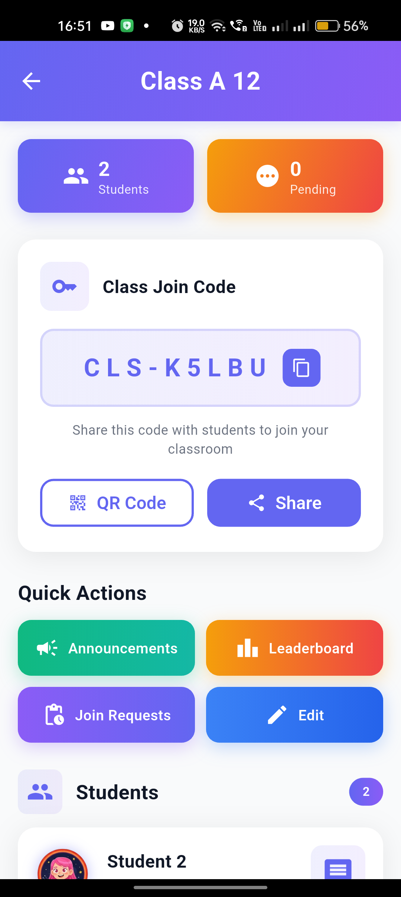<br/><b>Classroom Management</b></td>
    <td>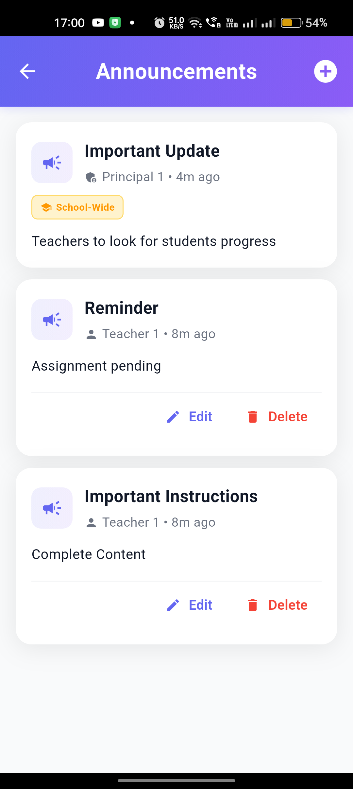<br/><b>Announcements</b></td>
    <td>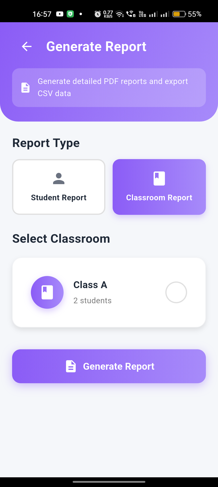<br/><b>Enhanced Reports</b></td>
  </tr>
  <tr>
    <td>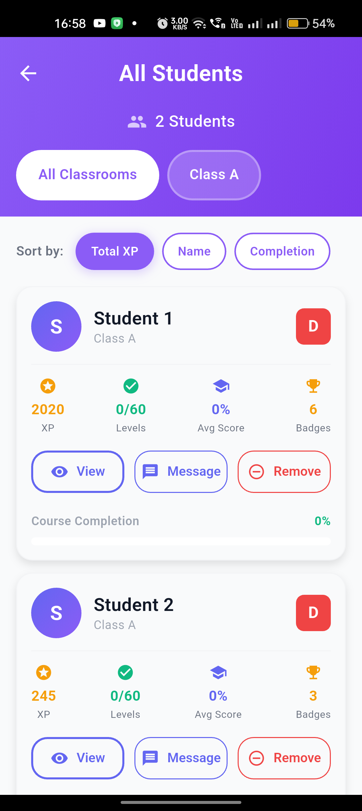<br/><b>Student Monitoring</b></td>
    <td><br/><b>Student Chat</b></td>
    <td>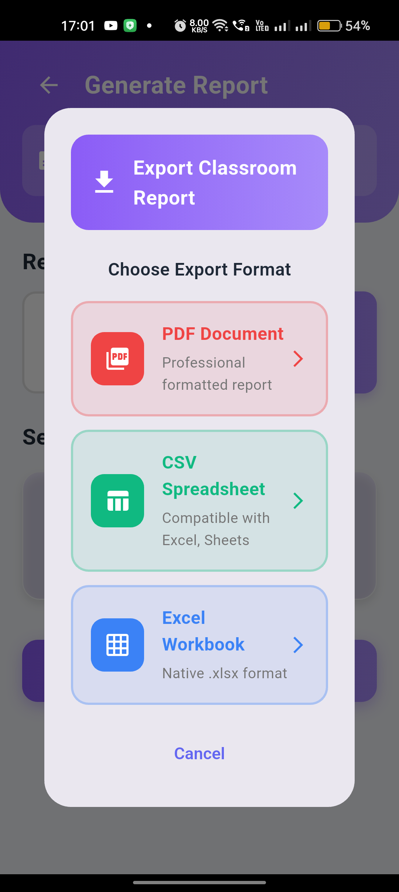<br/><b>Export Formats</b></td>
  </tr>
</table>

<div align="center">

### 🏫 Principal Experience

</div>

<table>
  <tr>
    <td>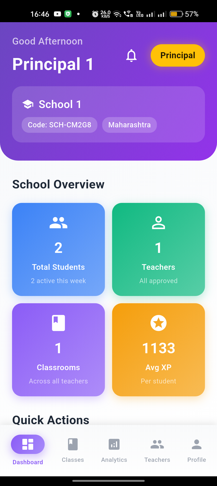<br/><b>School Overview</b></td>
    <td>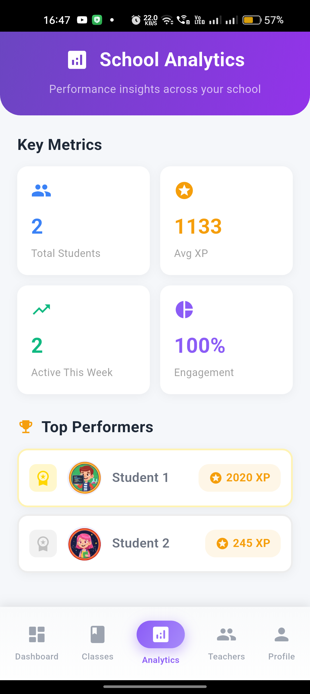<br/><b>School Analytics</b></td>
    <td>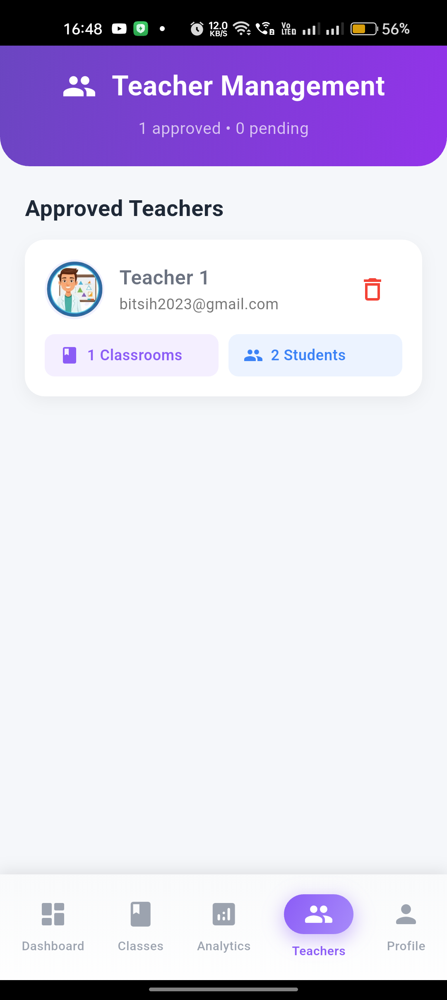<br/><b>Teacher Management</b></td>
  </tr>
</table>


---

## 🚀 Download

### 📱 Android APK

**Download latest version:**
- [GitHub Releases](https://github.com/PushkarPisolkar04/IPlay/releases) - Direct APK download


**Current Version:** v1.0.0

**Build APK:**
```bash
# Build release APK
flutter build apk --release

# Output: build/app/outputs/flutter-apk/app-release.apk
```
---

## 💻 Tech Stack

<div align="center">

**Built with Modern Technologies**

</div>

### Frontend
- **Flutter** 3.8.0+ - Cross-platform UI framework
- **Provider** - State management
- **Custom Design System** - Consistent UI/UX

### Backend & Services
- **Firebase Authentication** - Secure user auth
- **Cloud Firestore** - Real-time database
- **Firebase Analytics** - Usage tracking
- **Firebase App Check** - Security

### Features & Libraries
- **PDF Generation** - Premium certificate creation
- **Excel & CSV Export** - Data export with enhanced details
- **File Saver** - User-selected downloads
- **Connectivity Plus** - Network monitoring
- **QR Flutter** - QR code generation
- **Share Plus** - Social sharing


---

## 📊 Report Features

### Enhanced Data Exports

**Student Reports Include:**
- Name, Email, Total XP, Level
- Badges, Current Streak, Longest Streak
- **Completed Levels** - Track progress
- **Average Score** - Performance metrics
- Joined Date

**Classroom Reports Include:**
- Classroom info (name, teacher, grade, student count)
- **Class Statistics** - Total & average XP, streaks, badges, realms
- **Top 5 Performers** - Ranking with detailed metrics
- All students performance table
- Professional formatting

**Export Formats:**
- 📄 **PDF** - Professional formatted reports with sections
- 📊 **CSV** - Excel and Google Sheets compatible
- 📈 **Excel** - Native .xlsx format (single sheet, no duplicates)

---

## 🔒 Security & Privacy

- ✅ Firebase Authentication with role-based access
- ✅ Secure Firestore rules
- ✅ App Check for API protection
- ✅ No sensitive data in client code
- ✅ Encrypted data transmission
- ✅ Privacy-focused design

---

## 🌐 Offline Support

- ✅ Works offline with cached data
- ✅ Automatic sync when online
- ✅ Offline indicator
- ✅ No data loss guaranteed
- ✅ Seamless experience

---

## 🤝 Contributing

We welcome contributions! Feel free to:

- 🐛 Report bugs
- 💡 Suggest features
- 🔧 Submit pull requests
- 📖 Improve documentation

---

## 📄 License

This project is licensed under the MIT License - see the [LICENSE](LICENSE) file for details.

---

## 👨‍💻 Developer

**Pushkar Pisolkar**

- GitHub: [@PushkarPisolkar04](https://github.com/PushkarPisolkar04)
- Email: pushkarppisolkar@gmail.com

---

<div align="center">

### ⭐ Star this repo if you find it helpful!

**Made with ❤️ using Flutter**

---

### 🎯 Learn IP Rights • 🏆 Earn Badges • 📜 Get Certified

[](https://github.com/PushkarPisolkar04/IPlay/releases)

</div>